# ⚙️Hur ställer jag in granskning av tidrapporter?

**Datum:** den 23 oktober 2025  
**Kategori:** Time  
**Underkategori:** Attestering & Granskning  
**Typ:** config  
**Svårighetsgrad:** intermediate  
**Tags:** attestering, frånvaro, ob, saldo, schema, tidrapport, övertid  
**Bilder:** 13  
**URL:** https://knowledge.flexhrm.com/sv/hur-st%C3%A4ller-jag-in-granskning-av-tidrapporter

---

Ett exempel för uppsättning av klarmarkering, delattestering och attestering.
Du kan använda hur många granskningsnivåer du vill i ditt företag, och det finns stora möjligheter att ställa in nivåerna så att de passar just er. En vanlig utgångspunkt är att medarbetarna själva
klarmarkerar
sin tidrapport, och att deras chef sedan
attesterar
den. Om du också rapporterar tid på projekt vill du ofta att en projektansvarig
delattesterar
tiden på sitt projekt, mellan klarmarkeringen och attesteringen.
I det här exemplet går vi igenom hur du kan ställa in klarmarkering, delattestering och attestering. Du kan hoppa över steget med delattestering om ni inte vill granska tidrader som rapporterats på projekt.
Du hittar en beskrivning av alla inställningarna här:
Vilka inställningar kan göras för granskning av tidrapporter?
Inställning för klarmarkering
Förutsättning
: Vi vill att medarbetarna själva klarmarkerar sin tid för att visa att tidrapporten är färdigregistrerad.
Gå till
Inställningar > Allmänt > Granskningsnivåer > Tidrapporter
.
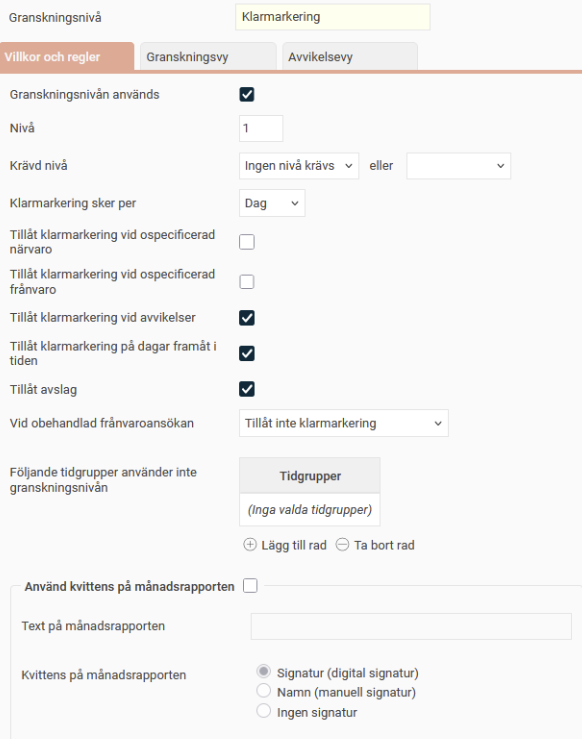
Ställ in att
klarmarkering
ska användas som nivå ett. Klarmarkering är den första granskningen av tidrapporten, så den kräver ingen annan nivå.
Välj att klarmarkering ska ske
per dag
. Medarbetarna kan då klarmarkera en dag i taget. De kan också vänta till månadsskiftet och granska hela perioden samtidigt.
Vi vill att medarbetarna ska utföra granskningen direkt i tidrapporten, utan en separat vy för klarmarkering. Bocka därför
inte
i
Aktivera granskningsvy
på fliken
Granskningsvy
.
Resultat
: Medarbetarna kan klarmarkera:
per dag i dagvyn,
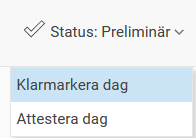
per dag i periodvyn
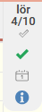
eller per period i periodvyn.
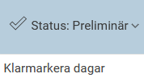
Inställning för delattestering (konteringsgranskning)
Förutsättning
: Vi vill att tidrader som har ett projekt (eller en annan kontering) granskas av den som är ansvarig för projektet.
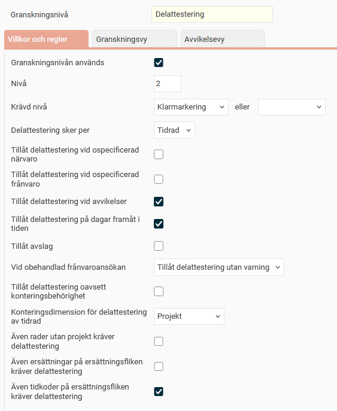
Sätt
Delattestering
som nivå 2.
Välj att delattestering ska ske
per tidrad och projekt
.
Välj
Klarmarkering
som
krävd nivå
. Detta gör att delattestering endast kan ske när den anställda har klarmarkerat sin tidrapport.
Gå till fliken
Granskningsvy
och bocka i
Aktivera granskningsvy
.
Resultat:
De användare som är behöriga att delattestera kan nu göra det per tidrad i tidrapporten:
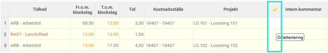
per dag i dagvyn:
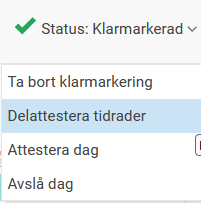
per dag i periodvyn:
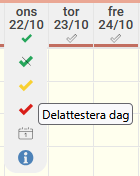
eller i en separat granskningsvy:
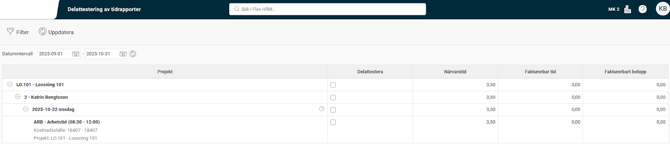
I vyn för delattest visas endast tidrader som är klarmarkerade, eftersom det är den krävda nivån.
Observera
: Detta gäller endast tidradsgranskning. I granskningsvyn för till exempel attestering visas alla tidrapporter inom datumurvalet, oavsett om de klarmarkerats eller delattesterats.
I vyn för delattest kan du endast se de tidrader du är behörig att granska. Behörigheten ställer du in per användare på fliken
Konteringsgranskning
i användarregistret.
Inställning för attestering
Förutsättning
: Vi vill att den anställdes chef ska attestera tidrapporten när medarbetaren har klarmarkerat den och de projektansvariga har delattesterat tidraderna som har projekt.
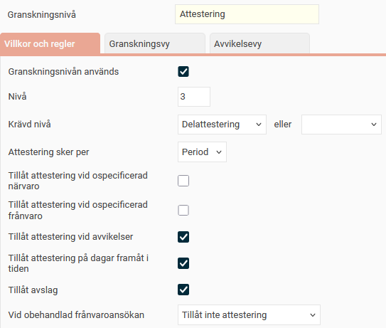
Välj
Delattestering
som
krävd nivå
för Attestering.
De dagar/tidrader som saknar projekt får statusen delattesterad direkt vid klarmarkering, och kvalificerar sig därmed för attestering. Förutsatt att du inte ställt in att även tidrader utan projekt måste granskas.
Ställ in att attestering sker
per period
. Detta innebär att cheferna måste attestera en hel period i taget, de kan inte attestera en dag i taget.
Aktivera granskningsvyn.
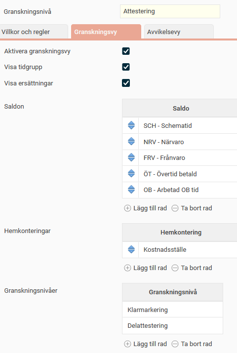
Ställ in att granskningsvyn ska visa:
De anställdas hemkostnadsställe
Saldon för schematid, närvaro, frånvaro, övertid och OB
Granskningsnivåerna
klarmarkering
och
delattestering
.
Resultat:
Attesterande chef kan attestera i tidrapporten eller i en separat granskningsvy.
I granskningsvyn får chefen en översikt baserat på inställningarna ni har gjort. Hen ser till exempel arbetad övertid och om tidrapporten är klarmarkerad och delattesterad.
Om granskning saknas finns information om vem som är behörig att granska.

