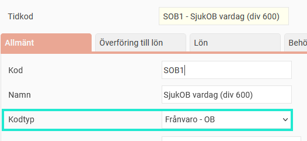
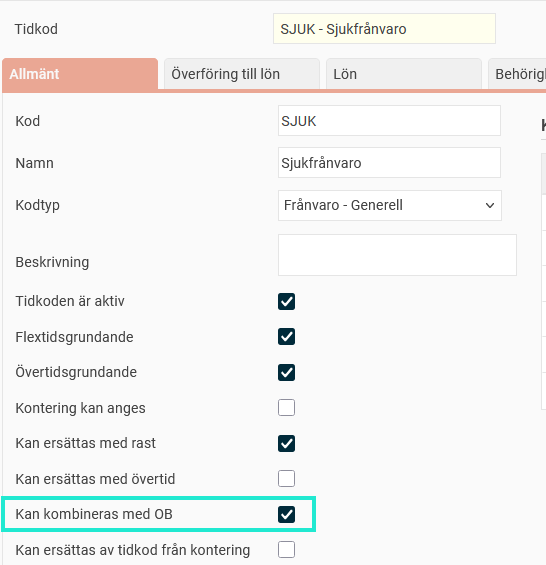

# ⚙️Hur ställer jag in regler för sjuk-OB?

**Datum:** den 26 september 2025  
**Kategori:** Time  
**Underkategori:** Tidrapportering  
**Typ:** config  
**Svårighetsgrad:** advanced  
**Tags:** frånvaro, lön, ob, tidkod, tidrapport  
**Bilder:** 4  
**URL:** https://knowledge.flexhrm.com/sv/hur-st%C3%A4ller-jag-in-regler-f%C3%B6r-sjuk-ob

---

Sjuk-OB används när OB-regler ska gälla vid sjukfrånvaro. För att detta ska fungera behöver du ställa in särskilda tidkoder och regler i systemet.
Skapa tidkoder för sjuk-OB
Lägg upp regler för sjuk-OB
Tidkodsinställning för att få kombineras med OB
Borttag av sjuk-OB
Skapa tidkoder för sjuk-OB
För att få sjuk-OB att fungera behöver du tidkoder för detta. Du kan kopiera dina befintliga OB-tidkoder och ändra de nya tidkoderna till kodtyp
Frånvaro-OB
. Se till att varje tidkod är kopplad till rätt löneart för ersättning. Kodtyp ställs in under
Inställningar > Tid och Bemanning > Tidkoder > fliken Allmänt
och löneart på fliken
Överföring till lön
.

Lägg upp regler för sjuk-OB
I OB-regelverket behöver du skapa regler för sjuk-OB. Dessa regler briukar spegla dina vanliga OB-regler. Om du till exempel har en OB-regel som säger att
OB1
ska falla ut mellan klockan 19:00 och 22:00, skapar du en motsvarande regel för
Sjuk-OB1
som också gäller mellan 19:00 och 22:00.
Sjuk-OB-reglerna ska vara inställda på att falla ut tillsammans med tidkoden för
Sjukfrånvaro
.

Tidkodsinställning för att få kombineras med OB
För att systemet ska kunna beräkna sjuk-OB korrekt måste du se till att tidkoden för
Sjukfrånvaro
kan kombineras med OB. Det gör du i tidkodsregistret, inställningen
Kan kombineras med OB.

Borttag av sjuk-OB
Systemet beräknar initialt sjuk-OB för alla sjukdagar, oavsett hur lång sjukperioden är. Varje natt körs en automatisk process som tar bort sjuk-OB från granskade dagar utifrån inställningen
Dagar för sjuk-OB
som kan göras per anställd, tidgrupp eller för hela företaget.
Det görs också en koll vid löneöverföring, så om man granskat tidrapporten samma dag som lönekörningen görs så plockas sjuk-OB bort vid överföringen till lön.

Inställningen
Dagar för sjuk-OB
kan vara:
Alla:
Sjuk-OB gäller för alla dagar i en sjukperiod, oavsett längd.
Endast dag 2-14:
Sjuk-OB tas bort från den första sjukdagen och från dag 15 och framåt.
Endast dag 1-14:
Sjuk-OB tas bort från dag 15 och framåt.
Endast från karensperiodens slut till dag 14:
Sjuk-OB tas bort under de första tjugo procent av den veckovisa arbetstiden och från dag 15 och framåt. Karensperioden är det faktiska arbetsmåttet per vecka, delat med fem. Arbetar man vardagar 8-17 blir det åtta timmar. Fler exempel nedan.
Exempel karensperiod
1: Säg att du arbetar 22:00-07:00 (60 min rast) fem dagar i veckan. Det ger en faktisk veckoarbetstid på 40 timmar, 40/5 är 8 timmar.
Du går hem sjuk tisdag morgon kl 05:00 och är sjuk resten av veckan. Det ger 2 timmar karens tisdag kl 05:00-07:00 samt 6 timmar onsdag -22:00-05:00. Sjuk-OB kommer alltså att falla ut fr o m kl 05:00 på onsdagen eftersom karensperioden är åtta timmar.
2: Du har en sysselsättningsgrad på 50%, faktiskt arbetsmått per vecka är 20 timmar. Karensperiod: 20/5 = 4.
Du arbetar tiotimmarspass måndagar och tisdagar, 19:00-+06:00. Är du sjuk en vecka dras sjuk-OB bort från måndagens första 4 timmar.
Relaterat
Hur fungerar OB-regelverk?
