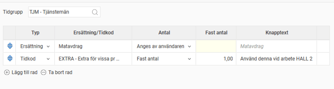
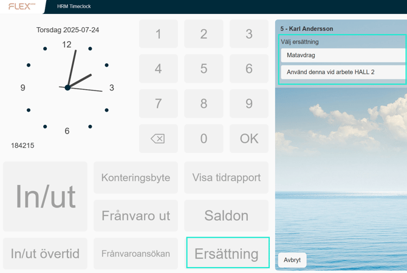
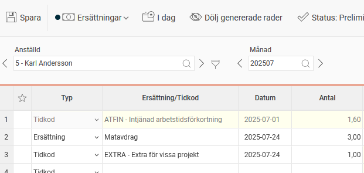

# ⚙️Hur ställer man in att Ersättningar ska kunna stämplas i HRM Timeclock?

**Datum:** den 13 januari 2026  
**Kategori:** Time  
**Underkategori:** Mobil & Stämpling  
**Typ:** config  
**Svårighetsgrad:** intermediate  
**Tags:** hrm-time, stämpling, tidkod, tidrapport  
**Bilder:** 3  
**URL:** https://knowledge.flexhrm.com/sv/hur-st%C3%A4ller-man-in-att-ers%C3%A4ttningar-ska-kunna-st%C3%A4mplas-i-hrm-timeclock

---

Stämplingsbara ersättningar
I HRM Timeclock finns möjlighet att stämpla ersättningar, det vill säga ange ersättningskoder eller tidkoder som faller ut under fliken
Ersättningar
i tidrapporten.
Ersättningskoder skapas under
Inställningar > Tid och Bemanning > Ersättningar.
Ställ in en knapp för ersättningar i er stämpelklocka. Det gör du under
Administration > Systemregister > Stämpelklockor.
Vidare behöver du välja vilka tidkoder/ersättningar du vill att användarna ska kunna stämpla, vilket görs under
Inställningar > Tid och Bemanning
>
Stämplingsbara ersättningar.
Klicka på
Lägg till rad
för att lägga till en ersättning eller tidkod som ska finnas som valbar för användarna i HRM Timeclock. Du kan även ange vilken knapptext som ska användas samt om användarna själva ska få välja antal eller om det alltid ska läggas ut med ett fast värde.

De stämplade ersättningarna hamnar under fliken
Ersättningar
i tidrapporten.

Tips!
Det går att ställa in en knapp i stämpelklockan för en specifik ersättningskod, istället för att användarna ska välja kod. Det gör du med hjälp av funktionen
Direktval
i stämpelklocksinställningen. Kom ihåg att namnge knappen så att det är tydligt vad den gör.
Relaterade artiklar
Ersättningar - Hur hanterar man ej timbaserade ersättningar i HRM Time?
Hur ändrar jag knapparna i stämpelklockan?
