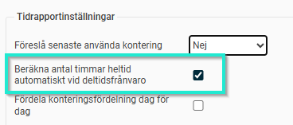

# ⚙️Hur ställer man in automatisk beräkning av heltidsmått vid en deltidsfrånvaro?

**Datum:** den 26 september 2025  
**Kategori:** Time  
**Underkategori:** Inställningar  
**Typ:** config  
**Svårighetsgrad:** advanced  
**Tags:** frånvaro, lön, ob, schema, tidrapport  
**Bilder:** 1  
**URL:** https://knowledge.flexhrm.com/sv/hur-st%C3%A4ller-man-in-automatisk-ber%C3%A4kning-av-heltidsm%C3%A5tt-vid-en-deltidsfr%C3%A5nvaro

---

Automatisk justering av antal timmar heltid
Om du har intermittent deltidsfrånvaro och är helt ledig vissa dagar vill en del lönesystem att antal timmar heltid ska fördelas på arbetsdagarna. Man kan antingen göra denna uträkning  manuellt eller att systemet räknar ut det automatiskt.
I tidrapportsinställningarna som finns per företag/tidgrupp/anställd kan du nu markera denna inställning:

För de med deltidsfrånvaro enligt schema (ej fast procent) kommer då antal timmar heltid automatiskt att beräknas på alla dagar enligt formeln:
Faktisk schematid / (100 - Frånvaroprocent) / 100
Ett exempel med en anställd som i vanliga fall jobbar 40 timmar per vecka men som har 30 % deltidsfrånvaro och jobbar 8 timmar måndag-onsdag och 4 timmar torsdag så kommer antal timmar heltid på respektive dag bli följande:
Mån: 8 h / (100 - 30) / 100 = 11,43
Tis: 8 h / (100 - 30) / 100 = 11,43
Ons: 8 h / (100 - 30) / 100 = 11,43
Tor: 4 h / (100 - 30) / 100 = 5,71
Fre: 0 h / (100 - 30) / 100 = 0,00
Lör: 0 h / (100 - 30) / 100 = 0,00
Sön: 0 h / (100 - 30) / 100 = 0,00
Observera att denna automatiska uträkning av antal timmar heltid även sker vid manuella schemaändringar på enskilda dagar.
Tips:
Vill du läsa om övriga inställningar i systemet som berör
deltidsfrånvaro
så klicka här.
