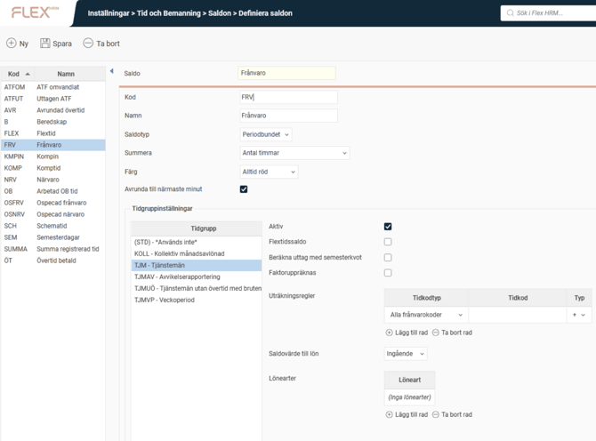

# ⚙️Hur ställer man in saldon?

**Datum:** den 26 september 2025  
**Kategori:** Time  
**Underkategori:** Inställningar  
**Typ:** config  
**Svårighetsgrad:** intermediate  
**Tags:** frånvaro, lön, ob, saldo, schema, semester, stämpling, tidkod  
**Bilder:** 1  
**URL:** https://knowledge.flexhrm.com/sv/saldon-hur-anpassar-och-visar-man-saldon

---

Den här artikeln förklarar hur man definierar olika saldon i systemet, som närvaro, frånvaro och övertid.
Här berättar vi om hur man skapar och ställer in saldon. Vill du veta mer om hur man anger vilka saldon som ska visas i tidrapporten, och hur de ska visas, rekommenderar vi denna artikel:
Hur ställer man in visning av saldon i tidrapporten och stämplingsterminaler?
Definiera saldon

Under
Definiera saldon
skapar du saldon och ställer in följande inställningar:
Kod
Namn
Saldotyp -
Periodbundet
innebär att saldot inte följer med till en ny period (ofta månad, men man kan ha veckoperiod, eller arbeta med bruten period, så att ny period börjar t.ex. dag 16 varje månad).
Rullande
innebär att saldot följer med till en ny period.
Summera -
Ett saldo kan summera
antal timmar
,
antal dagar
eller
antal dagar räknat mot schematid.
Exempel
: Ett saldo summerar tidkoden KMPIN. Schematid för en dag är 8 timmar. Man registrerar 4 timmar KMPIN.
Ett saldo som summerar
antal dagar
visar saldo
1.
Ett saldo som summerar
antal dagar räknat mot schematid
visar saldo
0,50.
Färg
Avrunda till närmaste minut -
Saldon visas som default decimalt. En halvtimme visas som 0,50. 5 min visas som 0,08.
Man vill ofta visa saldon i hela minuter, men det kan hända att man har saldon som summerar annat än tid, och uträkningar från Händelser man vill se exakt. Bockar man i
Avrunda till närmaste minut
kommer saldot aldrig att visa värden som t ex 0,09, eftersom det inte representerar någon minut (5 min är 0,08, 6 min är 0,10).
Tidgruppsinställningar
Aktiv
Flextidssaldo -
Bockar man i
Flextidssaldo
behöver man inte ställa in några uträkningsregler. Saldot kommer att visa
skillnaden mellan schemalagd tid och registrerad flextidsgrundande tid
.
Beräkna uttag med semesterkvot -
Saldon som summerar antal dagar kan ställas in på att beräkna uttag med semesterkvot.
Exempel:
Anställda som arbetar 4 dagar i veckan har 1,25 i semesterkvot. Tar man en veckas semester ska fem dagar dras från saldot, även om de egentligen är lediga fyra arbetsdagar.
Faktoruppräknas -
Tidkoder kan ha faktor, ofta 1,5 för enkel komp och 2,0 för kvalificerad komp. Om
Faktoruppräknas
är ibockad bryr sig saldot om tidkodens faktor, annars inte.
Uträkningsregler -
Ange vilka tidkodstyper/tidkoder som ska påverka saldot, och om de ska ge plus- eller minusvärde.
Saldovärde till lön -
Om saldot överförs till lön kan det vara periodens ingående värde, periodens utgående värde eller periodens saldovärde.
Lönearter -
Anger man en löneart här kommer saldot att överföras till lön. Saknas löneart överförs det inte till lön.
Observera
Det är vanligt att man överför de tidkoder som påverkar saldot till lön, och att man då inte vill överföra även saldot.
