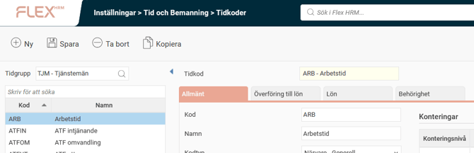
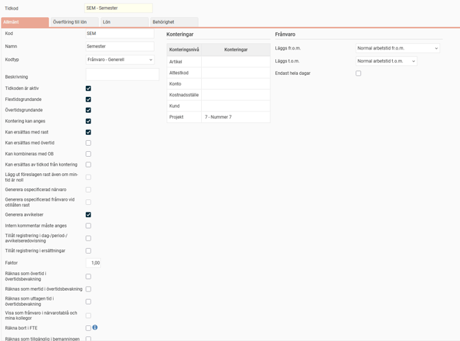
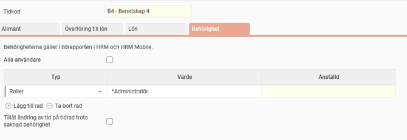

# ⚙️Hur ställer man in tidkoder?

**Datum:** den 29 september 2025  
**Kategori:** Time  
**Underkategori:** Frånvaro & Semester  
**Typ:** config  
**Svårighetsgrad:** advanced  
**Tags:** frånvaro, lön, ob, saldo, schema, semester, tidkod, tidrapport  
**Bilder:** 4  
**URL:** https://knowledge.flexhrm.com/sv/tidkoder-hur-st%C3%A4ller-man-in-tidkoder

---

Tidkoder i HRM Time länkar tidregistrering till lönesystemet. Nedan kan du läsa om inställningsvyn för tidkoder.
Fliken Allmänt
Fliken Överföring till lön
Fliken Behörighet
Tidkoder

Under inställningsvyn för tidkoder finns de koder som används i HRM Time som sedan är kopplade till lönesystemet. Tidkoderna skapas och ställs in per tidgrupp.
En ny tidkod kan skapas genom att kopiera en befintlig tidkod, och man kan kopiera tidkoder mellan tidgrupper.
Tidkoderna kan sedan vara kopplade till
frånvaroorsaker
,
saldon
,
händelseformler
,
regelverk
,
scheman
. Var därför noga om något justeras.
Fliken Allmänt
Det finns omfattande inställningsmöjligheter för varje tidkod, dessa förklaras nedan.

Kod.
Namn.
Kodtyp.
Styr hur tidkoden hanteras i systemet, hur den summeras etc.
Beskrivning.
Kan användas som en vägledning till användaren om när och hur tidkoden ska användas. I tidrapporten och i övriga vyer där tidkoden kan väljas kommer beskrivningen att visas som ett tooltip när du håller muspekaren över tidkoden i söklistan.
Tidkoden är aktiv.
En inaktiv tidkod kan inte väljas i tidrapporten eller i inställningsvyer. Den kan fortfarande falla ut från tidigare gjorda inställningar.
Flextidsgrundande.
Innebär att tidkoden fyller ut dagens flextid. Om man t.ex. har arbetstid 8 timmar och registrerar 6 timmars närvaro + 2 timmar av tidkoden SJUK behöver SJUK vara flextidsgrundande för att dagen inte ska få 2 timmar minusflex.
Övertidsgrundande.
Innebär att tid registrerad med denna tidkod räknas med i den tid som övertidsregelverket kräver för att övertid ska kunna falla ut.
Kontering kan anges.
Styr om konteringar (t.ex. projekt och kostnadsställe) ska kunna anges på tidrader där tidkoden angetts.
Kan ersättas med rast.
Markeras om rast ska kunna falla ut från schemat när tidkoden används.
Kan ersättas med övertid.
Markeras om övertid ska kunna falla ut från övertidsregelverket när tidkoden används.
Kan kombineras med OB.
Markeras om OB ska kunna falla ut från OB-regelverket tillsammans med tidkoden.
Kan ersätta av tidkod från kontering.
Har effekt om man använder funktionen för avvikande tidkoder. Avvikande tidkoder ger möjlighet att ange en tidkod i t.ex. projektregistret, för att en viss tidkod ska falla ut i tidrapporten när projektet används. Denna tidkod faller då endast ut om man rapporterar projektet tillsammans med en tidkod som är inställd på att den kan ersättas av tidkod från kontering.
Inställningen kan vara användbar om du t.ex. inte vill att övertid ska skrivas över utan endast normal arbetstid.
Lägg ut föreslagen rast även om min-tid är noll.
Raster har en minsta tid, en maxtid och en föreslåtid. En rastregel med minsta tid 0 minuter och föreslå 60 minuter gör att om den anställde inte anger någon rast kommer 60 minuter rast att läggas ut i tidrapporten. Vill man inte att detta ska ske kan man avmarkera inställningen. Det läggs då inte ut någon rast om den anställde inte registrerat någon sådan.
Generera ospecificerad närvaro.
Styr om tid registrerad på tidkoden ska kunna bli opecifierad närvaro i tidrapporten.
Generera ospecificerad frånvaro vid otillåten rast.
Styr om ospecificerad frånvaro ska genereras om rast som registreras på tidkoden ligger utanför tillåtet rastfönster.
Generera avvikelser.
Styr om tid registrerad på tidkoden ska kunna generera avvikelser i tidrapporten. Vad som ger avvikelser ställs in under inställningarna för tidrapporter, tidgrupper eller anställda.
Läs mer om tidrapportens inställningsnivåer
Intern kommentar måste anges.
Det går att spara tidkoden i en tidrapport utan att ange kommentar, men man kommer inte att kunna granska tidrapporten.
T
il
låt registrering i dag-/period-/avvikelseredovisning.
Styr om tidkoden ska gå att välja i tidrapporten.
Tillåt registrering i ersättningar.
Styr om tidkoden ska gå att välja i tidrapportens vy Ersättningar.
Faktor.
Default 1. Ange en annan faktor om tid registrerad med tidkoden ska räknas annorlunda i saldon. Det kan t.ex. handla om tidkoder för komp som ska räknas upp med 1,5 eller 2.
Räknas som övertid i övertidsbevakning.
S
tyr vilka tidkoder som räknas som övertid i övertidsbevakningen på startsidan.
Räknas som mertid i övertidsbevakning.
Styr vilka tidkoder som räknas som mertid i övertidsbevakningen på startsidan.
Räknas som uttagen tid i övertidsbevakning.
Styr vilka tidkoder som räknas som uttagen tid i övertidsbevakningen på startsidan.
Visa som frånvaro i närvarotablå och mina kollegor.
Används om en närvarokod som t.ex. "tjänsteärende" ska visas som frånvaro även om det i tidrapporten räknas som närvaro.
Räkna bort i FTE.
Används om tid registrerad på tidkoden inte ska räknas med i beräkningen av FTE.
FTE är antalet heltidstjänster och används i Statistikcentralen och i dashboards.
Räknas som tillgänglig i bemanningen.
I Flex HRM Plan finns det möjlighet att schemalägga personal på olika uppdrag även om de ska räknas som tillgängliga för andra uppdrag. Det kan vara användbart t.ex. om en anställd har kompetens att utföra uppdrag A men under en period går bredvid för att lära sig uppdrag B. Den anställde bidrar då inte till att ett behov täcks på uppdrag B och är samtidigt tillgänglig om det skulle behövas på uppdrag A.
Konteringar.
Konteringar som anges här kommer att läggas ut i tidrapporten när tidkoden används.
Frånvaro.
Styr hur stämplad frånvaro ska läggas ut i tidrapporten i förhållande till schemat.
Fliken
Överföring till lön

På fliken Överföring till lön ställer man in hur tid som rapporterats på tidkoden ska överföras till lön. Kopplingen till löneart är en signal om att tiden ska med till lönesystemet. Tidkoder som inte kopplas till en löneart överförs inte till lön.
Här ställer man in följande inställningar. Det är viktigt att inställningarna stämmer överens med det som lönesystemet önskar få in.
Gruppering av lönetransaktioner.
Gruppering av lönetransaktioner för deltidsfrånvaro.
Inkludera del av dag frånvaro i början eller slutet av en frånvaroperiod.
Antalsfältet i lönetransaktionen skall innehålla (t.ex. antal dagar).
Överför semesterkvot till lön.
Överför omfattning till lön.
Löneart.
Orsakskod.
Fliken Behörighet
Du kan tilldela behörighet för specifika tidkoder till användare, roll och/eller konteringar.

Styrs behörigheten till en roll är en användare behörig om denne har rollen för den anställd som tidrapporten gäller.
Styrs behörigheten till en kontering är en användare behörig om denne är kopplad till en anställd som har den angivna konteringen som hemkontering (fliken
Kontering
i
Anställdaregistret
).
Det går alltid att se tidkoder i tidrapporten oavsett behörighet. Behörigheten ger möjlighet att skapa och redigera tidrader med tidkoden. Inställningen "Tillåt ändring av tid på tidrad trots saknad behörighet" kan användas om man endast vill begränsa möjligheten att ange tidkoden, men tillåta redigering av redan utlagd tid.
