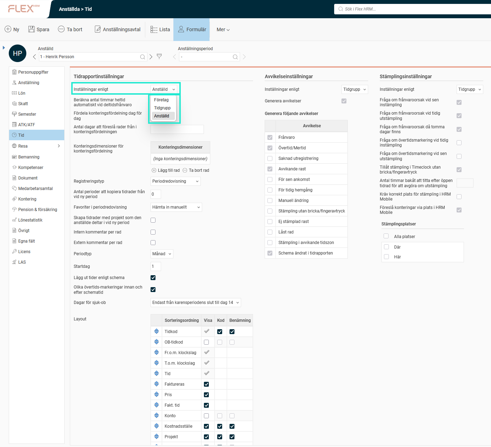

# ⚙️Hur ställer man in Tidrapporten?

**Datum:** den 29 september 2025  
**Kategori:** Time  
**Underkategori:** Inställningar  
**Typ:** config  
**Svårighetsgrad:** intermediate  
**Tags:** tidrapport  
**Bilder:** 1  
**URL:** https://knowledge.flexhrm.com/sv/tidrapporter-hur-st%C3%A4ller-man-in-tidrapporten

---

Tidrapporten kan ställas in på flera nivåer. Den mest specifika nivån gäller.
Tidrapportsinställningar
Tidrapportens utseende och inställningar kan definieras på 3 olika nivåer:
Företag (
Tidrapporter
)
Tidgrupp (
Tidgrupper > fliken Tid
)
Anställd (
Personuppgifter > fliken Tid
)
Den mest specifika inställningen gäller. Det innebär att företagets inställning endast gäller om man inte ställt in något annat på tidgrupps- eller anställdnivå.

Tänk på att:
Om en anställd har inställningar enligt anställd får förändringar som görs på tidgrupps- eller tidrapportnivå inte genomslag för denne anställd.
