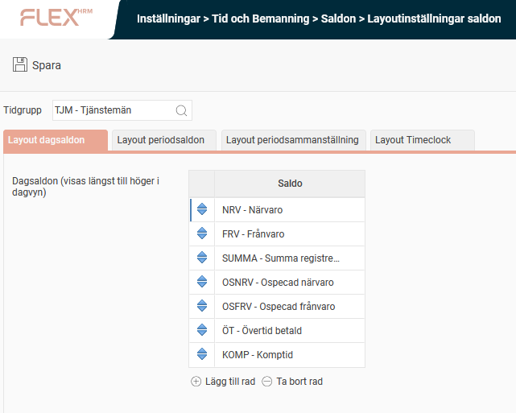
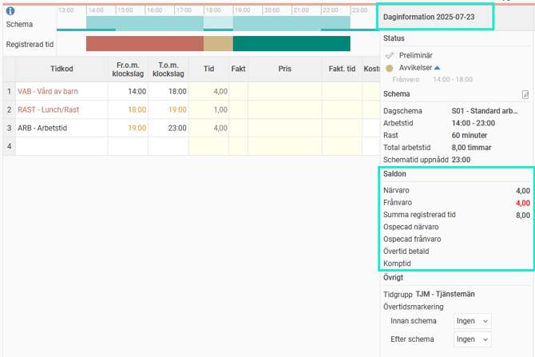
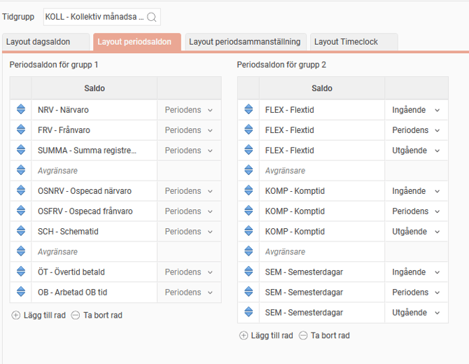
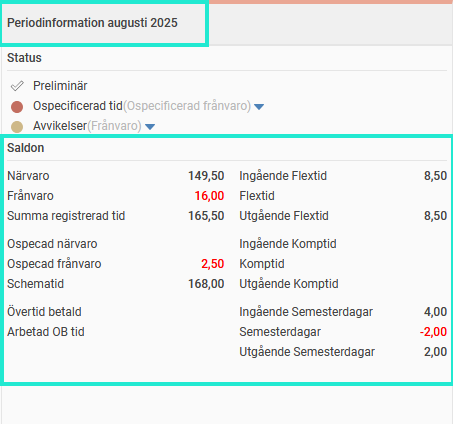
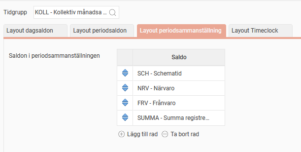
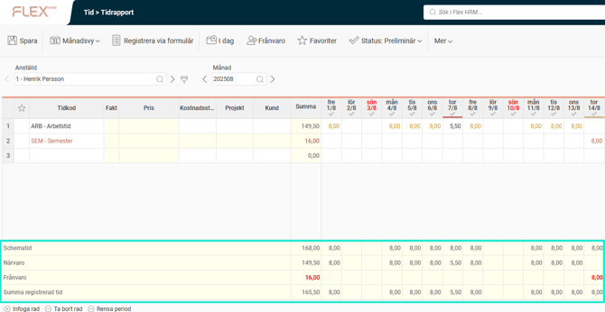

# ⚙️Hur ställer man in visning av saldon i tidrapporten och stämplingsterminaler?

**Datum:** den 29 oktober 2025  
**Kategori:** Time  
**Underkategori:** Mobil & Stämpling  
**Typ:** config  
**Svårighetsgrad:** intermediate  
**Tags:** frånvaro, ob, saldo, schema, semester, stämpling, tidrapport, övertid  
**Bilder:** 6  
**URL:** https://knowledge.flexhrm.com/sv/hur-st%C3%A4ller-man-in-visning-av-saldo-i-tidrapporten-och-st%C3%A4mplingsterminer

---

Under Layoutinställningar saldon kan man ställa in visning av saldon i tidrapporten och i HRM Timeclock. Det är även möjligt att anpassa vilka saldon som syns för olika tidgrupper.
Här berättar vi om hur man ställer in visning av saldon i tidrapporten. Vill du skapa eller ställa in ett saldo rekommenderar vi denna artikel:
Hur ställer man in saldon?
Daginformation
Periodinformation
Periodsammanställning
Timeclock
Hur påverkar tidgruppsbyten saldovisningen?
Layoutinställningar
Under
Layoutinställningar saldon
ställer man in per tidgrupp vilka saldon som ska visas, och hur de ska placeras i tidrapporten (
dagsaldon, periodsaldon, periodsammanställningen
) och i
stämpelklockan
.
Layout dagsaldon
Här lägger du upp de dagsaldon som företaget vill visa i tidrapportens kolumn
Daginformation
.
I vårt exempel nedan visar vi i alla tidrapporter för anställda i tidgrupp TJM saldon för Närvaro, Frånvaro, Summa registrerad tid, Ospecificerad närvaro, Ospecificerad frånvaro, Övertid betald, och Komptid.

Vill du ta bort saldot från layouten klickar du på saldot ifråga, följt av
Ta bort rad
. När du sedan sparar försvinner det och kommer inte att visas i tidrapporten.
Layout periodsaldon
Dessa saldon visas i kolumnen för
Periodinformation
i tidrapporten. Notera att du för rullande saldon kan visa tre olika värden för samma saldo: ingående, periodens respektive utgående värde.
I vårt exempel nedan väljer vi att i
Periodsaldon för grupp 1
visa närvaro, frånvaro, summa registrerad tid, ospecad närvaro, ospecad frånvaro, schematid, övertid betald och arbetad OB.
Avgränsare
innebär att man får en blankrad i kolumnen, vilken kan vara bra för läsbarheten
I
Periodsaldon för grupp 2
visar vi andra saldon: flextid ingående/periodens/utgående, komptid ingående/periodens/utgående, semesterdagar ingående/periodens/utgående.

Layout periodsammanställning
Dessa saldon syns i sammanställningen längst ner i tidrapportens periodvyer.
I exemplet nedan visar vi schematid, närvaro, frånvaro och summa registrerad tid.

Hur påverkar tidgruppsbyten saldovisningen?
Om en anställd ser olika saldon i sin tidrapport i olika perioder måste han ha gjort ett tidgruppsbyte. Man kan inte ställa in visningen på annat än tidgruppsnivå.
Byter man tidgrupp mitt i en period visar periodsaldon och periodsammanställning utifrån layoutinställningen för den tidgrupp man har periodens första dag. Om man inte är anställd periodens första dag, eller inte är tilldelad någon tidgrupp då, går den på den första dagen i perioden som man är anställd/har en tidgrupp
Layout Timeclock
De saldon som ställs in under
Layout Timeclock
visas i stämplingsterminaler, knappen
Saldon
.
