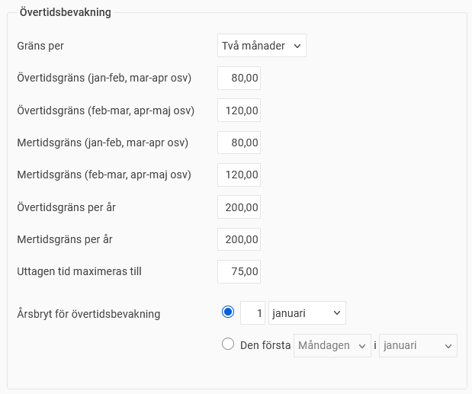
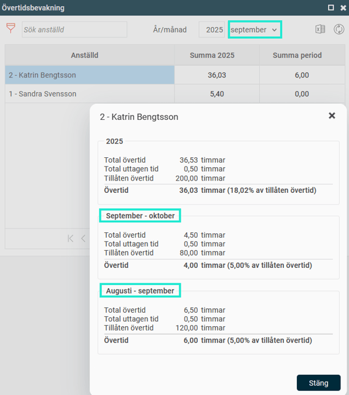

# ⚙️Hur ställer vi in övertidsbevakningen för tvåmånadersperioder?

**Datum:** den 26 september 2025  
**Kategori:** Time  
**Underkategori:** Inställningar  
**Typ:** config  
**Svårighetsgrad:** intermediate  
**Tags:** övertid  
**Bilder:** 2  
**URL:** https://knowledge.flexhrm.com/sv/hur-st%C3%A4ller-vi-in-%C3%B6vertidsbevakningen-f%C3%B6r-tv%C3%A5m%C3%A5nadersperioder

---

O
m du har avtal som reglerar övertidsuttag per tvåmånadersperiod kan du använda inställningarna för övertidsbevakning för att hantera detta. Flex HRM kan då bevaka två olika perioder samtidigt: en som startar med en jämn månad (jan-feb, mar-apr etc.) och en som startar med en ojämn månad (feb-mar, apr-maj etc.).
För att aktivera den här funktionen, gå till följande plats i systemet:
Inställningar > Tid och Bemanning > Tidgrupper > fliken Tid
Där visas extra fält för övertidsgräns/mertidsgräns för er som använder övertidsbevakningen med två månaders-period. Genom att fylla i värden i dessa fält kan du sedan se båda de två perioderna som matchar den valda månaden.

Se övertidsperioderna för en anställd
För att se övertidsperioderna för en specifik anställd, gå till startsidan. Där klickar du på det blå
i:et
intill den anställdes namn i övertidsbevakningen. Då visas båda de två olika perioderna som matchar den aktuella månaden.

