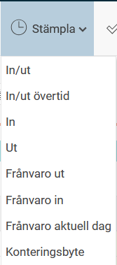

# Hur stämplar jag direkt i tidrapporten?

**Datum:** den 15 oktober 2025  
**Kategori:** Time  
**Underkategori:** Mobil & Stämpling  
**Typ:** howto  
**Svårighetsgrad:** intermediate  
**Tags:** frånvaro, mobil, ob, stämpling, tidrapport, övertid  
**Bilder:** 1  
**URL:** https://knowledge.flexhrm.com/sv/hur-st%C3%A4mplar-man-direkt-i-tidrapporten

---

Det finns olika sätt att stämpla sin tid i HRM Time. Det går att använda stämplingsterminaler (HRM Timeclock), det finns en stämplingsfunktion i HRM Mobile och du kan använda en stämplingsfunktion i menyraden i din tidrapport. Det sistnämnda beskrivs i denna artikel.
Med stämplingsfunktionen i tidrapporten kan du stämpla dina tider i realtid som ett alternativ till att manuellt skriva in dessa i tidrapportens inmatningsbild.
Använder ni stämplingsfunktionen i tidrapporten hittar du en ikon för
Stämpla
i tidrapportens meny.
Förutom att stämpla in/ut för dagen eller för rast finns det möjlighet att stämpla In/ut övertid, In, Ut, Frånvaro ut, Frånvaro in, Frånvaro aktuell dag och Konteringsbyte. Vilka av dessa stämplingsalternativ som ska vara aktiva ställs in under
Administration > Användare/Behörigheter > Roller.

Funktionaliteten är densamma som när du stämplar i HRM Timeclock och HRM Mobile, med eventuella frågor vid sen ankomst osv
.
Vid alternativet
In/ut
känner systemet automatiskt av om en in- eller utstämpling ska göras: varannan gång in och varannan gång ut.
Klockslaget för stämplingen kommer att hämtas från servern där HRM är installerat.
Relaterade artiklar
Hur fungerar stämplingsterminalen?
Hur stämplar man sin tid i mobilen?
