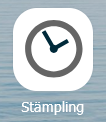
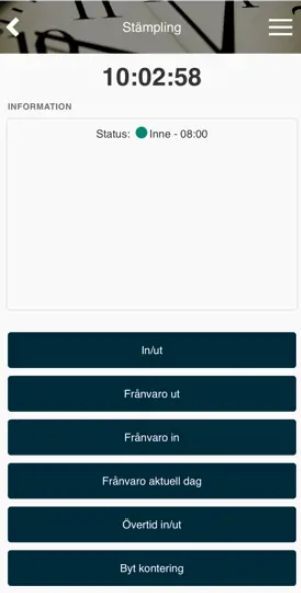
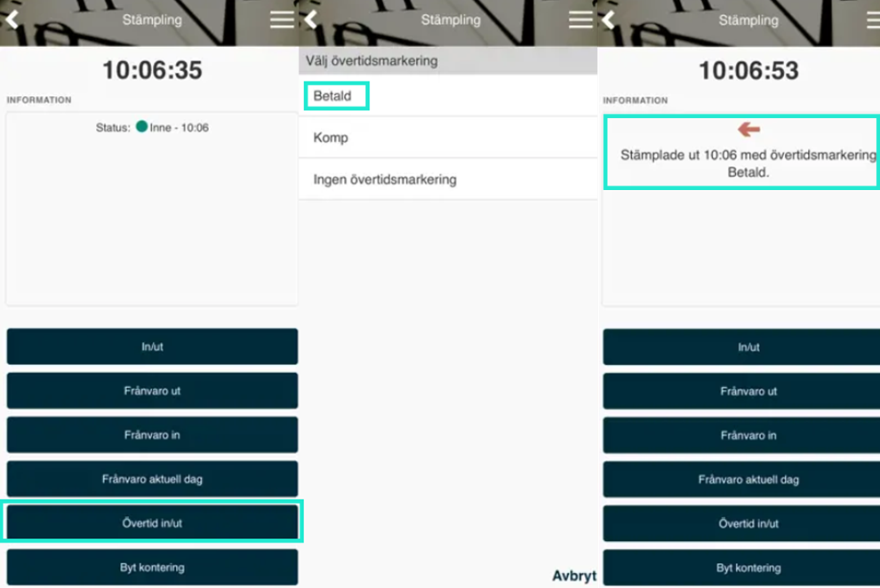

# Hur stämplar man sin tid i HRM Mobile?

**Datum:** den 8 januari 2026  
**Kategori:** Time  
**Underkategori:** Övertid & Ersättning  
**Typ:** howto  
**Svårighetsgrad:** intermediate  
**Tags:** frånvaro, mobil, ob, stämpling, tidrapport, övertid  
**Bilder:** 3  
**URL:** https://knowledge.flexhrm.com/sv/hur-st%C3%A4mplar-man-sin-tid-i-mobilen

---

HRM Mobile - Stämpling
I
HRM Mobile
, vyn
Stämpling
hittar du funktioner för stämpling.
Observera
att olika val kan finnas tillgängliga beroende på era inställningar.

In/ut
Används för att stämpla ankomst, rast och hemgång. Information om status efter stämpling visas längst upp.
Frånvaro ut
Används när du stämplar ut med frånvaro, vare sig det är en stund under dagen eller längre tid. Stämpling med
Frånvaro ut
startar en
rullande
frånvaro
(=frånvaro utan slutdatum) som avbryts när du stämplar in nästa gång eller stoppar den i frånvarohanteraren.
Frånvaro in
Används när du stämplar in med frånvaro t.ex. när du varit på tjänsteärende innan du kom till jobbet.
Frånvaro aktuell dag
Används när du stämplar ut med frånvaro för resten av dagen.
Övertid in/ut
Med denna funktion stämplar du antingen ankomst eller hemgång samt anger vilken typ av övertidsersättning som ska falla ut.

Byt kontering
Klicka på den konteringsdimension du vill byta. Vet du t.ex. vad projektet heter, kan du skriva i en sökruta, och möjliga träffar listas i sökresultatet. Vill du välja från konteringsregistret istället för att söka hittar du menyn
Register
i sidomenyn.
Relaterade artiklar
Hur fungerar stämplingsterminalen?
Hur stämplar man direkt i tidrapporten?
