# Hur tidrapporterar jag i mobilen?

**Datum:** den 18 augusti 2025  
**Kategori:** Time  
**Underkategori:** Tidrapportering  
**Typ:** howto  
**Svårighetsgrad:** advanced  
**Tags:** attestering, mobil, ob, saldo, schema, stämpling, tidkod, tidrapport  
**Bilder:** 13  
**URL:** https://knowledge.flexhrm.com/sv/hur-sk%C3%B6ter-jag-min-tidrapportering-i-mobilen

---

Tidrapporten kan administreras i HRM Mobile. Denna artikel beskriver hur tidrapporten i HRM Mobile fungerar för både dag- och periodredovisare.
Hantera tidrader
Daginformation
Granska dag
Uppdatera dag
Kontrollera dag
Övertidsmarkering
Ersättningar
Notering
Konteringsfördelning

I
HRM Mobile
, vyn
Tidrapport
ser du alla tidrader, dag för dag. Du kan redigera alla tidrader och du kan manuellt sköta din tidrapport härifrån.
Hantera tidrader
För att registrera en ny tidrad, klicka på plustecknet.
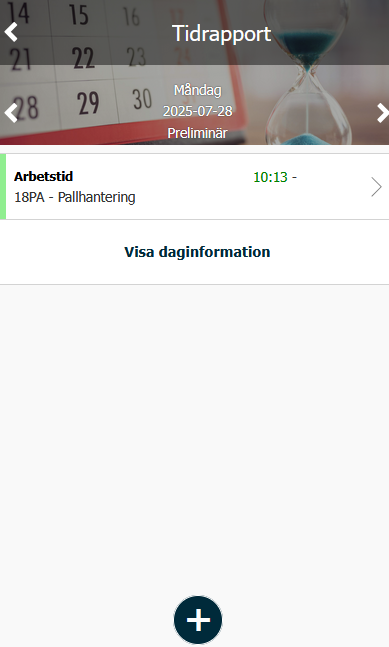
Vyn för ny tidrad föreslår standardtidkoden för arbete, vilken kan ändras.
Dagredovisare
anger klockslag om det föreslagna inte stämmer (bilden till vänster nedan), medan
periodredovisare
anger antal timmar (bilden till höger nedan).
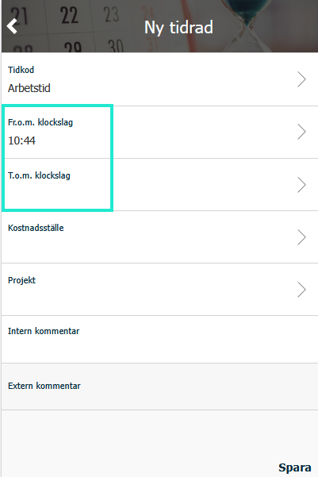
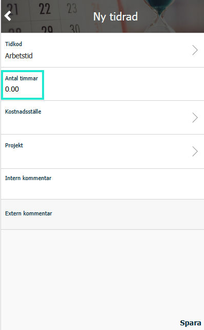
Kontera tiden med projekt, kostnadsställe etc genom att klicka på respektive konteringsdimension.
Om det tillåts kan faktureringsinformation ändras och faktureringspris visas. Stämmer inte antal fakturerbara timmar med den arbetade tiden går detta också att justera.
Möjlighet finns att lämna intern kommentar till tidraden. Är raden fakturerbar går det också bra att lämna en extern kommentar.
Daginformation
Klicka på knappen
Visa daginformation
för att se information om dagen som schematider, status och saldon.
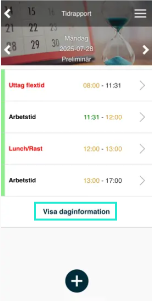
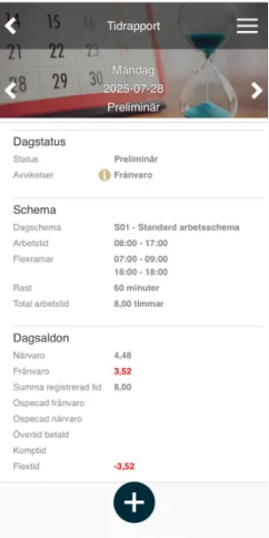
Granska dag
Tidrapportens sidomeny har en funktion för att
granska
dagen. Väljer man att visa
veckovy
eller
månadsvy
kan man granska flera dagar samtidigt.
Observera
att begreppen för granskning är inställningsbara och kan heta något annat hos er. Här har vi valt att använda två nivåer för granskning och kalla dem
Klarmarkering
och
Attestering
.
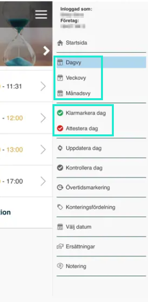
Uppdatera dag
Klicka på
Uppdatera dag
i sidomenyn
för att ladda om dagen. Det kan göras om man haft tidrapporten inladdad medan t.ex. en stämpling eller en schemaändring gjorts.
Kontrollera dag
Klicka på
Kontrollera dag
i sidomenyn för att få information om eventuella problem i tidrapporten. I exemplet till höger kommer man inte att kunna granska tidrapporten på grund av att en tidkod är inställd på att en intern kommentar måste anges, men sådan saknas.
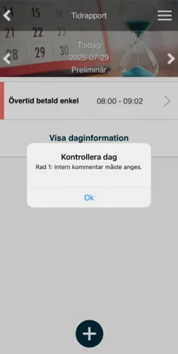
Övertidsmarkering
Har du arbetat övertid kan du klicka på
Övertidsmarkering
i sidomenyn
för att välja vilken typ av övertid, och för att övertiden ska falla ut enligt uppsatt regelverk. Används endast vid
dagredovisning
.
Ersättningar
Klicka på
Ersättningar
i sidomenyn för att se och registrera ersättningar.
Notering
Klicka på
Notering
i sidomenyn för att ange en notering för dagen. Noteringar kan visas i Närvarotablån och Kalendern i HRM Time, Närvarotablån i HRM Timeclock och i Mina kollegor i HRM Mobile.
Konteringsfördelning
Istället för att ange konteringar per rad kan du använda funktionen
Konteringsfördelning
som du hittar i sidomenyn. Denna används när det inte är viktigt när tiden gjordes utan antal timmar det tog.
Konteringsfördelningen behöver inte göras dag för dag utan kan göras i ett längre datumintervall. Den behöver heller inte göras med antal timmar utan kan göras
i procent av den rapporterade tiden (ändra mellan timmar och procent i sidomenyn).
Exempel
I exemplet nedan har åtta timmar arbetstid registrerats för en dag. Dessa ska fördelas lika mellan två kostnadsställen.
1:
Klicka på
Konteringsfördelning
i
sidomenyn
.
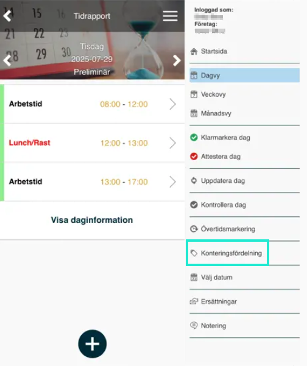
2:
En rad för åtta timmar utan kontering visas (eftersom det är vad som ligger i tidrapporten). Klicka på denna rad. Ange kostnadsställe och ändra antal timmar till 4. Om önskat kan du lägga in en kommentar.
Spara
.
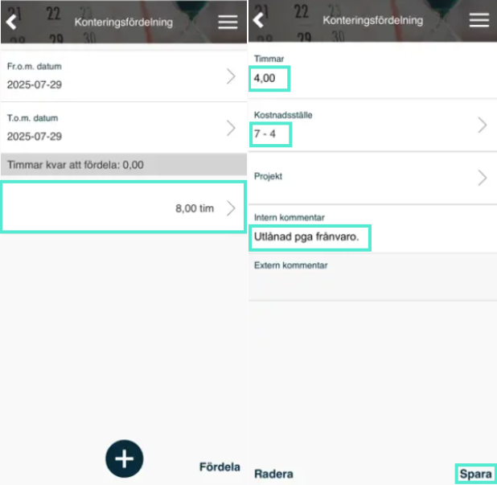
3:
Klicka på
plustecknet
för att lägga till en ny rad. Ange antal 4, ange kostnadsställe och Spara.
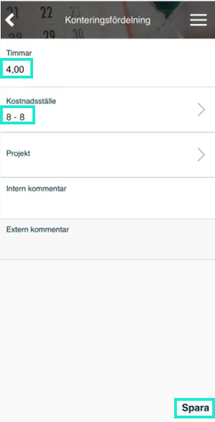
4:
Klicka på
Fördela
.
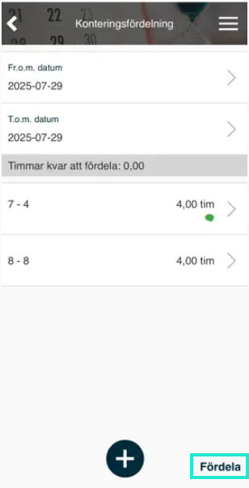
5:
Tidraderna i tidrapporten fördelas som önskat.
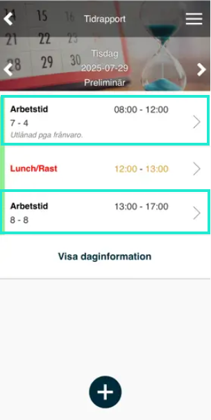
Relaterade artiklar:
Vad betyder de olika begreppen i HRM Time?
Dagredovisning i HRM Time
Periodredovisning i HRM Time
