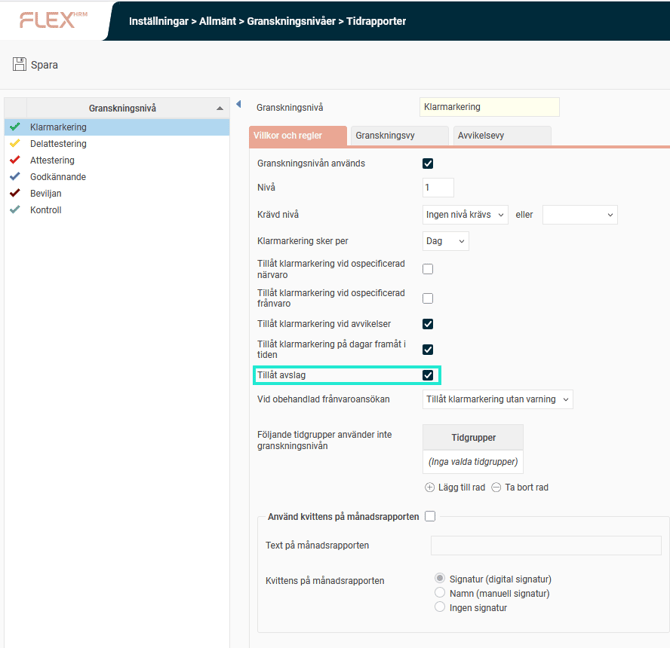
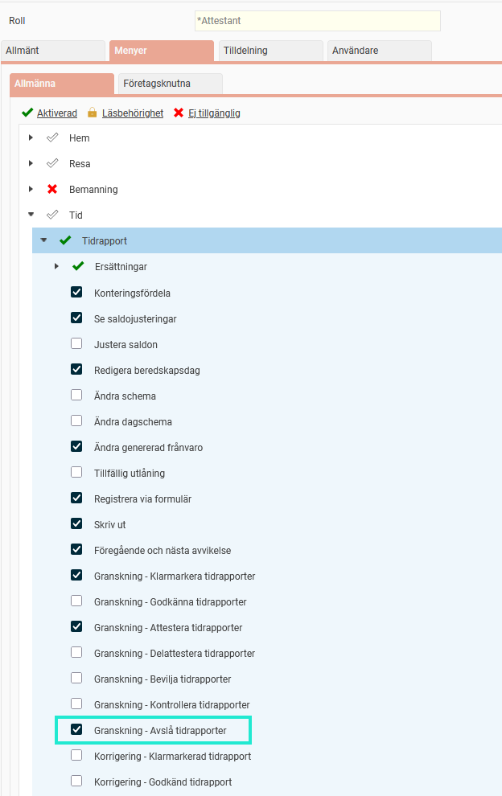
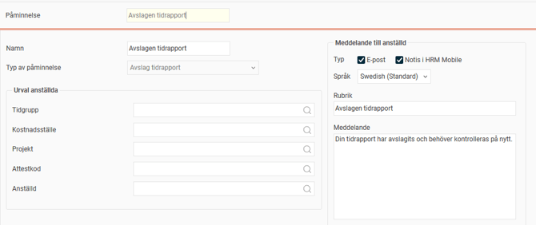

# ⚙️Hur tillåter man avslag av tidrapporter?

**Datum:** den 26 september 2025  
**Kategori:** Time  
**Underkategori:** Inställningar  
**Typ:** config  
**Svårighetsgrad:** intermediate  
**Tags:** mobil, ob, tidrapport  
**Bilder:** 3  
**URL:** https://knowledge.flexhrm.com/sv/hur-till%C3%A5ter-man-avslag-av-tidrapporter

---

Inställningar för att tillåta avslag, behörighet samt påminnelse till anställd.
Här beskriver vi inställningarna som behöver göras för att man ska kunna avslå tidrapporter. Vill du läsa om hur man gör när man avslår rekommenderar vi denna artikel:
Hur gör man för att avslå tidrapporter?
Avslå tidrapport - inställningar
Det finns möjlighet att avslå en granskad tidrapport och skriva en kommentar till den anställde kring vad som behöver korrigeras.
Du ställer in vilken status du vill tillåta avslag på. Till exempel kanske du vill att en dag ska få avslås när den är klarmarkerad men inte när den är attesterad. Det gör du genom att markera
Tillåt avslag
på granskningsnivån det gäller under
Granskningsnivåinställningarna
för Tidrapporter.

Behörighet för att avslå ställer du in på den roll det gäller under
Användare/Behörigheter > Roller.
Inställningen finns under noden
Tid > Tidrapport
och heter
Granskning - Avslå tidrapporter.

Du kan också ge en påminnelse till den anställde om en dag eller period blivit avslagen. Under
Påminnelser
ställer du in det på liknande sätt som andra påminnelser och väljer om det ska skickas som e-post och/eller notis i HRM Mobile.

