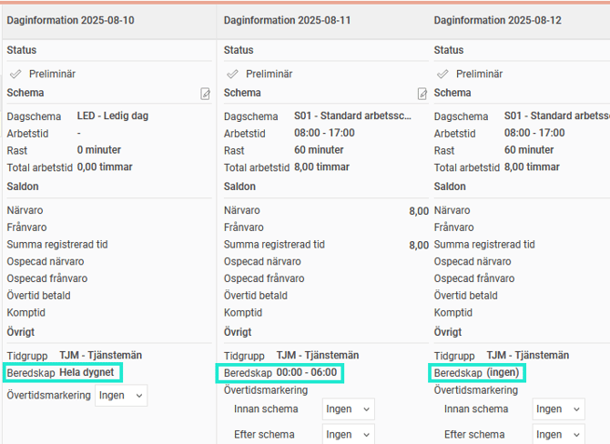
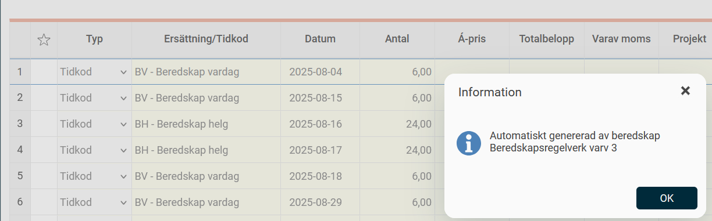

# Hur visas beredskap i tidrapporten?

**Datum:** den 15 augusti 2025  
**Kategori:** Time  
**Underkategori:** Tidrapportering  
**Typ:** howto  
**Svårighetsgrad:** advanced  
**Tags:** beredskap, schema, tidkod, tidrapport  
**Bilder:** 2  
**URL:** https://knowledge.flexhrm.com/sv/hur-visas-beredskap-i-tidrapporten

---

Du kan i tidrapportens kolumn
Daginformation
se information om ditt beredskapsschema.
Bilde
n nedan visar en dag med bere
dskap hela dygnet, en dag med beredskap fram till kl 6 på morgonen och en dag då man inte är schemalagd med beredskap.

Tidkoder för beredskap visas på fliken
Ersättningar.

För information om att skapa beredskapsregelverk och att schemalägga beredskap:
Hur fungerar beredskapsregelverk?
