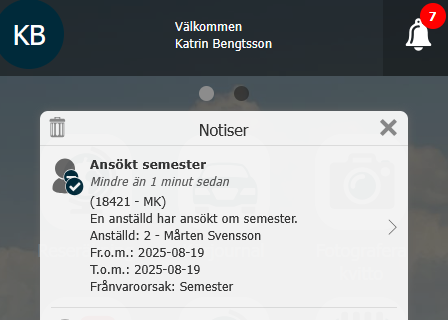
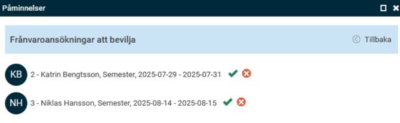

# ⚙️Kan anställda få en påminnelse när deras semester är godkänd?

**Datum:** den 26 september 2025  
**Kategori:** Time  
**Underkategori:** Frånvaro & Semester  
**Typ:** config  
**Svårighetsgrad:** intermediate  
**Tags:** frånvaro, mobil, ob, semester  
**Bilder:** 3  
**URL:** https://knowledge.flexhrm.com/sv/kan-anst%C3%A4llda-f%C3%A5-en-p%C3%A5minnelse-n%C3%A4r-deras-semester-%C3%A4r-godk%C3%A4nd

---

Artikeln innehåller information om de påminnelser som kan skickas vid frånvaroansökan.
Påminnelsen
Frånvaroansökan
kan skickas när:
En anställd har ansökt om frånvaro.
En anställd har registrerat en frånvaro som inte kräver granskning i frånvarohanteraren.
En chef har godkänt en ansökan om frånvaro.
En chef har avslagit en ansökan om frånvaro.

Du kan i påminnelsen göra urval på frånvaroorsak, om du t.ex. vill ha en separat påminnelse för bara semesteransökningar. Påminnelsen på bilden ovan ska skickas till användare med rollen MK Administratör när en anställd ansökt om semester.
Meddelande till den anställde som frånvaron gäller kan skickas via e-post och notis i HRM Mobile. Meddelande till användare kan förutom e-post och notis visas i panelen för påminnelser på startsidan i HRM.
Den notis som visas i HRM Mobile kan du klicka på för att öppna frånvarovyn i HRM Mobile, och hantera frånvaroansökan.

I påminnelsen på startsidan kan du använda ikonerna för att bevilja eller avslå frånvaroansökan.

Läs mer om påminnelser i HRM:
Hur fungerar påminnelser?
