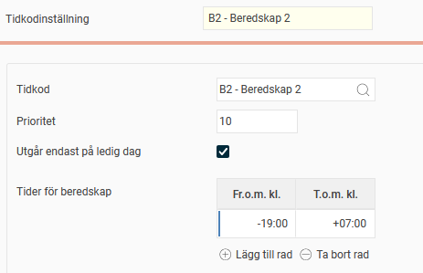

# ⚙️Kan beredskap på ledig dag gälla även för dagen före och dagen efter ledig dag?

**Datum:** den 30 oktober 2025  
**Kategori:** Time  
**Underkategori:** Inställningar  
**Typ:** config  
**Svårighetsgrad:** advanced  
**Tags:** beredskap, schema, tidkod  
**Bilder:** 1  
**URL:** https://knowledge.flexhrm.com/sv/kan-beredskap-p%C3%A5-ledig-dag-g%C3%A4lla-%C3%A4ven-f%C3%B6r-dagen-f%C3%B6re-och-dagen-efter-ledig-dag

---

I Flex HRM finns det en inställning i beredskapsregelverket för att en tidkodsinställning endast ska gälla på ledig dag. Om beredskap ska falla ut med en särskild ersättning även kvällen innan och morgonen efter ledig dag, kan du ställa in det på tidkodsinställningen.
Så här ställer du in beredskap för dagarna runt en ledig dag
I beredskapsregelverket finns inställningen
Utgår endast på ledig dag
. Denna anger att en tidkodsinställning endast ska gälla på dagar då du inte är schemalagd för arbete.
Om ditt avtal säger att beredskap ska gälla på lediga dagar, samt kvällen innan och morgonen efter ledig dag, kan du lägga till klockslag med plus (+) och minus (-) på tidkodsinställningen.
Exempel:
Om du ställer in regeln
-19:00
-
+07:00
kommer ersättningen att falla ut:
Från klockan
19:00
dagen innan ledig dag.
På den lediga dagen.
Fram till klockan
07:00
morgonen efter den lediga dagen.

Relaterade artiklar
Hur fungerar beredskapsregelverk?
