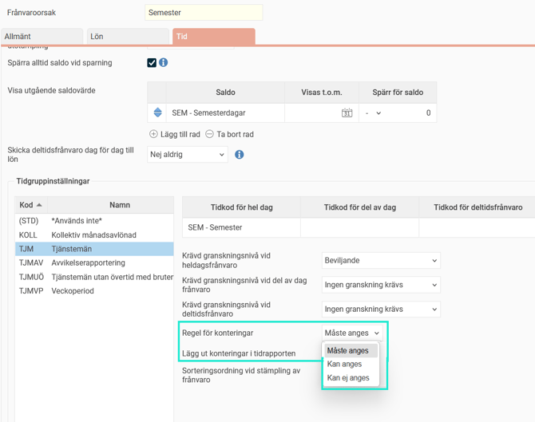
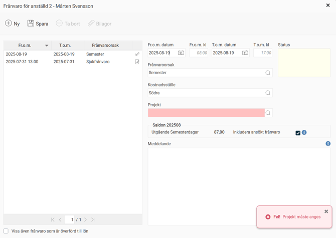
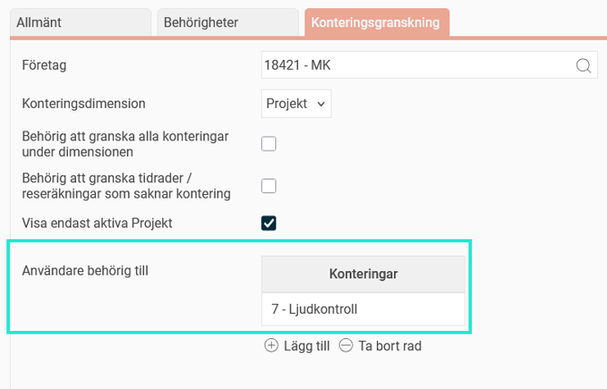
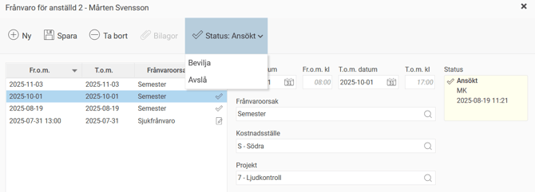
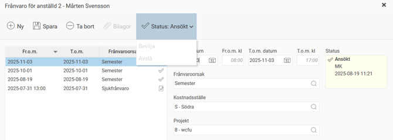

# ⚙️Kan delattestbehörighet användas för frånvarogranskning?

**Datum:** den 26 september 2025  
**Kategori:** Time  
**Underkategori:** Tidrapportering  
**Typ:** config  
**Svårighetsgrad:** intermediate  
**Tags:** frånvaro, mobil, ob, semester, tidkod, tidrapport  
**Bilder:** 5  
**URL:** https://knowledge.flexhrm.com/sv/kan-delattestbeh%C3%B6righet-anv%C3%A4ndas-f%C3%B6r-fr%C3%A5nvarogranskning

---

Kontering på frånvaro kan användas för att styra behörighet och för att generera konteringar på tidrader från frånvarohanteraren.
Det går att knyta en eller flera konteringsdimensioner till frånvarohanteringen. Syftet med det är dels behörighet, att frånvaroansökan ska granskas av den som är behörig att granska konteringen istället för av den anställdes chef, dels att man vill att konteringar från frånvaroansökan ska läggas ut i tidrapporten.
Under
Inställningar > Allmänt > Konteringsdimensioner > Tid
kan du bocka i
Använd vid frånvaro
för en eller flera konteringsdimensioner.
Du kan sedan för varje
frånvaroorsak
ställa in om konteringar måste/kan/inte kan anges samt om de angivna konteringarna ska falla ut i tidrapporten. För detta krävs också att tidkoden som genereras är inställd på att kontering kan anges.
Om du inte gör några förändringar på frånvaroorsakerna är standard att projekt måste anges samt att det kommer att läggas ut i tidrapporten.

I frånvarohanteraren kommer det att finnas fält för att ange konteringar när man väljer en frånvaroorsak som är inställd på att konteringar kan eller måste anges. Vid måste anges går det inte att spara utan att ha angett konteringar.

En användare som via fliken Konteringsgranskning är behörig till den kontering som registrerats på en frånvaroansökan kommer sedan att få upp den frånvaroansökan på startsidan i HRM samt i HRM Mobile där man granskar frånvaroansökningar. Det gäller även påminnelser som kan skickas via e-post eller som notis i HRM Mobile.

Exempel
Användare KB är behörig att granska projekt 7.
Anställd 2 ansöker om Semester en dag i oktober med projekt 7, en dag i november med projekt 8.
Användare KB får granska, och får påminnelser om, oktober-frånvaron, men är inte behörig att granska november-frånvaron.

Observera
att användningen av en konteringsdimension i frånvarohanteringen inte slår ut vanlig behörighet. Vill ni att frånvaro endast ska granskas av den som är behörig till ett projekt behöver ni se över era roller och behörigheter, så att det inte finns användare med behörighet att granska anställdas frånvaro.
Bra att veta om kontering på frånvaro
Konteringsnivåer som är inställda på att läggas ut från projekt ärver i frånvarohanteraren både konteringar och regler från projektregistret.
Exempel
Frånvaroorsaken Semester är inställd på att kostnadsställe och projekt måste anges.
Konteringsnivån kostnadsställe är inställd på att läggas ut från projekt.
I projektregistret är projekt X kopplat till kostnadsställe S.
Projekt Y är inte kopplat till något kostnadsställe, men har regel inställt på "Kan anges" (inte måste).
1:
En anställd ansöker om semester och anger projekt X.
I frånvarohanteraren måste denne endast ange projekt X, kostnadsställe S hämtas automatiskt.
2:
En anställd ansöker om semester och anger projekt Y.
I frånvarohanteraren måste denne endast ange projekt Y, kostnadsställe krävs inte eftersom regeln "kan anges" från projektregistret gäller.
