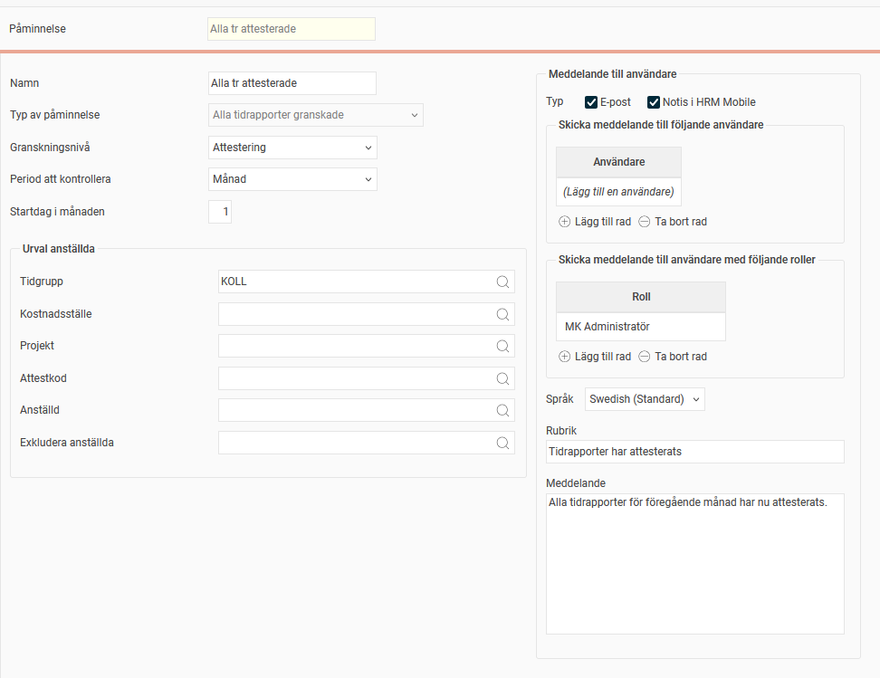
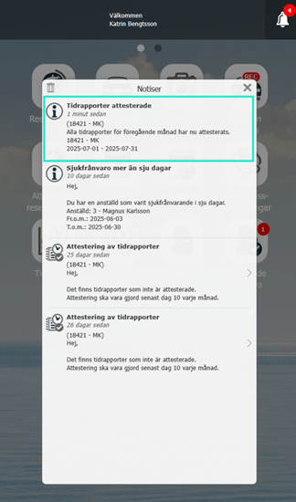

# ⚙️Kan HRM Time skicka en påminnelse när alla periodens tidrapporter är redo att överföras till lön?

**Datum:** den 26 september 2025  
**Kategori:** Time  
**Underkategori:** Inställningar  
**Typ:** config  
**Svårighetsgrad:** intermediate  
**Tags:** hrm-time, lön, mobil, ob, tidrapport  
**Bilder:** 2  
**URL:** https://knowledge.flexhrm.com/sv/kan-hrm-time-skicka-en-p%C3%A5minnelse-n%C3%A4r-alla-periodens-tidrapporter-%C3%A4r-redo-att-%C3%B6verf%C3%B6ras-till-l%C3%B6n

---

Artikeln informerar om påminnelsen "Alla tidrapporter granskade".
Med hjälp av påminnelsen
Alla tidrapporter granskade
kan du få en påminnelse när alla tidrapporter som ska granskas har blivit granskade.
Påminnelsen används ofta för att löneadministratören ska veta att det går bra att starta överföringen av tidrapporter till lön, men den kan ställas in för alla granskningsnivåer.

Bilden ovan visar inställningen för påminnelsen. Du väljer granskningsnivå och om kontrollen ska göras på vecka eller månad. Valet månad ger också möjlighet att sätta startdatum. Sätt 1 om du vill kontrollera tidrapporter utifrån kalendermånad.
Likt övriga påminnelser finns möjlighet att göra urval på tidgrupp, hemkonteringar och anställda om bara vissa i företaget ska inkluderas. Det finns även möjlighet att exkludera anställda, vilket kan vara användbart om du t.ex. har testpersoner eller extern personal som inte granskas.
När sista tidrapporten som berörs av påminnelsen har granskats kommer en påminnelse att skickas till de mottagare man angivit.
Mottagare kan vara enskilda användare eller användare som har en viss roll. Väljer ni att skicka till en roll räcker det att man har rollen för företaget, det görs ingen koll på om man har den för specifika anställda.
Påminnelsen kan skickas via e-post och/eller som en notis i HRM Mobile. Det går inte att visa den i panelen för påminnelser på startsidan i HRM.

Vad händer om en anställd ingår i urvalet endast en del av månaden?
Säg att påminnelsen är inställd på att skicka för alla anställda med hemkostnadsställe
X
och att anställd 2 tillhör hemkostnadsställe
X
fr.o.m. 2 juli.
När påminnelsen skickas för perioden 1-31 juli inkluderas tidrapporten för anställd 2, trots att denne ingår i urvalet endast en del av perioden.
Vad händer om en tidrapport avgranskats efter att påminnelsen skickats?
Påminnelsen kan inte dras tillbaka.
När tidrapporten omgranskats kommer en ny påminnelse att skickas, då det återigen blir en granskning av periodens sista tidrapport.
Läs mer om påminnelser i HRM:
Hur fungerar påminnelser?
