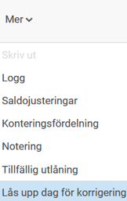
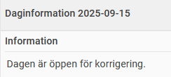
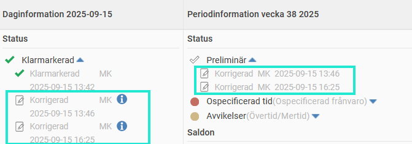
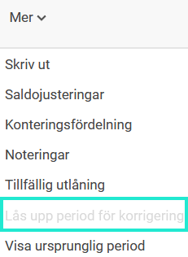

# Kan jag ändra i en tidrapport som är granskad/överförd till lön?

**Datum:** den 29 september 2025  
**Kategori:** Time  
**Underkategori:** Tidrapportering  
**Typ:** faq  
**Svårighetsgrad:** intermediate  
**Tags:** lön, ob, tidrapport  
**Bilder:** 4  
**URL:** https://knowledge.flexhrm.com/sv/kan-jag-%C3%A4ndra-i-en-tidrapport-som-%C3%A4r-granskad/%C3%B6verf%C3%B6rd-till-l%C3%B6n

---

Behöver du ändra en tidrapport som redan är granskad eller överförd till lön? Med funktionen
Korrigera tidrapport
kan du göra justeringar utan att behöva ta bort granskningen eller backa överföringen. Detta är användbart om du till exempel vill rätta en kontering för att få korrekt statistik i en rapport.
Korrigera tidrapport (Dagredovisning)
För att korrigera en tidrapport för en dagredovisare, gör så här:
Gå in på den tidrapport du vill ändra.
Välj
Mer
>
Lås upp dag för korrigering
.

I kolumnen
Daginformation
ser du att dagen nu är öppen för korrigering.

Gör dina ändringar och klicka på
Spara
.
När du har korrigerat en dag kan du se hur den såg ut från början genom att klicka på
Mer
>
Visa ursprunglig dag
. Där kan du även välja att
återställa till ursprunglig dag
om du vill ångra korrigeringen.
I kolumnerna
Daginformation
och
Periodinformation
kan du se vem som har korrigerat tidrapporten och när det gjordes.

Korrigera tidrapport (Periodredovisning)
Om du jobbar med periodredovisning kan du inte låsa upp enbart en dag, utan måste låsa upp hela perioden.
Gå in på den tidrapport du vill ändra.
Välj
Mer
>
Lås upp period för korrigering
.
I kolumnen
Periodinformation
ser du att perioden nu är öppen för korrigering.
Gör dina ändringar och klicka på
Spara
.
När du har korrigerat en period kan du se hur den såg ut från början genom att klicka på
Mer
>
Visa ursprunglig period
. Där kan du även välja att
återställa till ursprunglig period
om du vill ångra korrigeringen.
I kolumnerna
Daginformation
och
Periodinformation
kan du se vem som har korrigerat tidrapporten och när det gjordes.
Observera
Behörigheten att korrigera tidrapporter kan sättas på olika nivåer. Det kan till exempel vara så att du får korrigera en klarmarkerad tidrapport, men inte en som är överförd till lön.
Om valet för att låsa upp tidrapporten för korrigering är gråmarkerat, beror det på att tidrapporten antingen är preliminär eller att den är granskad/överförd på en nivå som du inte har behörighet att ändra.

