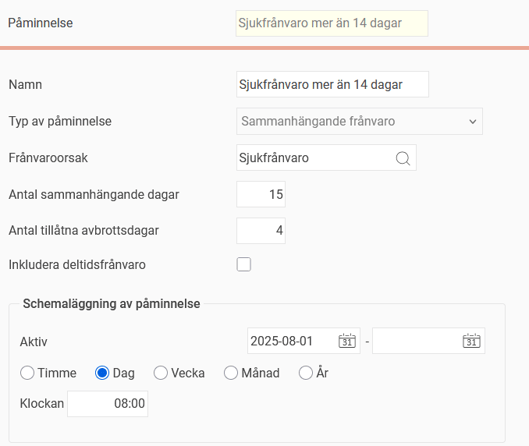
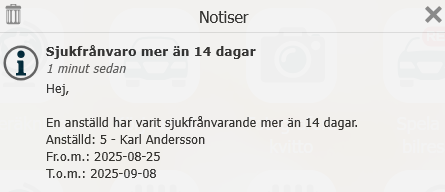

# ⚙️Kan jag få en påminnelse vid sammanhängande sjukfrånvaro?

**Datum:** den 26 september 2025  
**Kategori:** Time  
**Underkategori:** Inställningar  
**Typ:** config  
**Svårighetsgrad:** intermediate  
**Tags:** frånvaro, schema  
**Bilder:** 3  
**URL:** https://knowledge.flexhrm.com/sv/kan-jag-f%C3%A5-en-p%C3%A5minnelse-vid-sammanh%C3%A4ngande-sjukfr%C3%A5nvaro

---

Beskrivning av påminnelsen för sammanhängande sjukfrånvaro, med inställningar och exempel.
I HRM Time finns en funktion för att skicka ut påminnelser vid sammanhängande frånvaro. Den här påminnelsen kan du använda för att exempelvis meddela en anställd att det är dags att lämna in ett sjukintyg, eller för att påminna en chef eller administratör att anmäla frånvaron till Försäkringskassan.
I påminnelsen ställer du in frånvaroorsak, den kan alltså användas för annan frånvaro än just sjukdom.

Hur påminnelsen fungerar
Påminnelserna skickas ut vid en bestämd tidpunkt, ofta dagligen på morgonen. Flex HRM räknar antal dagar med sammanhängande sjukfrånvaro för att utlösa påminnelsen.
En påminnelse till den anställda skickas vanligtvis efter mer än sju dagars sammanhängande sjukfrånvaro, för att hen ska veta att det är dags att skicka in ett sjukintyg.
En påminnelse till en chef eller administratör skickas vanligtvis efter mer än fjorton dagars sammanhängande sjukfrånvaro, för att hen ska veta att det är dags att anmäla till Försäkringskassan.
Om du till exempel ställer in en påminnelse för åtta dagars sammanhängande sjukfrånvaro kommer påminnelsen att skickas på morgonen dag nio. Det är då systemet ser att åtta dagars sammanhängande frånvaro har uppnåtts.
Kalenderdagar eller arbetsdagar?
Påminnelsen räknar på kalenderdagar, inte arbetsdagar. För att Flex HRM ska räkna perioden som sammanhängande måste det finnas sjukfrånvaro på både den första och sista dagen.
Om den åttonde sjukdagen inträffar på en ledig dag måste även dag nio ha sjukfrånvaro för att påminnelsen ska skickas ut. Detta beror på att Flex HRM inte kan veta om dag åtta ska räknas annars. Samma princip gäller om du tillåter avbrottsdagar.
Vad är avbrottsdagar?
Avbrottsdagar är till för att hantera återinsjuknande. Enligt återinsjuknanderegeln räknas en sjukperiod som sammanhängande om du blir sjuk inom fem dagar från att du har friskförklarats. I Flex HRM kan du tillåta fyra avbrottsdagar för att hantera detta.
Du behöver inte ange avbrottsdagar för att hantera lediga dagar. Om en anställd exempelvis arbetar måndag till fredag och är sjuk torsdag och fredag, för att sedan insjukna igen på måndag till onsdag, räknas det som sju sammanhängande dagar oavsett om du tillåter avbrottsdagar.
Räknas deltidsfrånvaro in i sammanhängande frånvaro?
Påminnelsen har inställningen
Inkludera deltidsfrånvaro
. Använd denna för att generera påminnelser även för deltidsfrånvaro.
Exempel: Påminnelser vid sammanhängande frånvaro
Nedan ser du några exempel som illustrerar hur påminnelsefunktionen för sammanhängande frånvaro fungerar. I dessa exempel har vi ställt in att en påminnelse ska skickas efter femton sammanhängande dagars sjukfrånvaro, och att upp till fyra avbrottsdagar är tillåtna.

Exempel 1: Olika startdatum för frånvaron
Anställd 5 och anställd 7 är schemalagda måndag till fredag.
Anställd 5 har varit sjukfrånvarande från måndag den 25 augusti. När påminnelsen kontrolleras på morgonen den 9 september har femton kalenderdagar passerat med sammanhängande sjukfrånvaro. Påminnelsen skickas därför ut för anställd 5.

Anställd 7 har varit sjukfrånvarande från tisdag den 26 augusti. Vid kontrollen på morgonen den 9 september har fjorton kalenderdagar passerat. Eftersom påminnelsen är inställd på att skickas efter femton dagar, skickas den inte för anställd 7. Den kommer istället att skickas ut på morgonen den 10 september.
Exempel 2: Avbrott i sjukperioden
Anställd 3, som är schemalagd måndag till fredag, har varit sjukfrånvarande den 25 augusti till den 3 september, och sedan igen från den 8 september. Mellan de två perioderna har han alltså haft fyra avbrottsdagar 4-7 september.
Eftersom påminnelsen tillåter upp till fyra avbrottsdagar räknas de två sjukperioderna som en sammanhängande frånvaro. Men när påminnelsen kontrolleras den 9 september (kalenderdag 16 efter 25 augusti) har bara tolv dagar med faktiskt registrerad sjukfrånvaro passerat. Påminnelsen skickas därför inte. Den kan skickas först den 13 september, när totalt femton dagar med sjukfrånvaro har passerat.
Exempel 3: Frånvaro under en ledig dag
Anställd 8 har varit sjukfrånvarande sedan måndag den 25 augusti. Hon är ledig den 7 och 8 september, och påminnelsen kontrolleras på morgonen den 9 september.
Eftersom hon är ledig den 7 och 8 september, kan Flex HRM inte veta om sjukfrånvaron är sammanhängande. Påminnelsen skickas därför inte den 9 september. Om anställd 8 är schemalagd och fortsätter att vara sjukfrånvarande den 9 september, kommer systemet att uppfatta att sjukperioden är sammanhängande, och påminnelsen kommer då att skickas ut den 10 september.
Relaterat
Hur fungerar Påminnelser?
