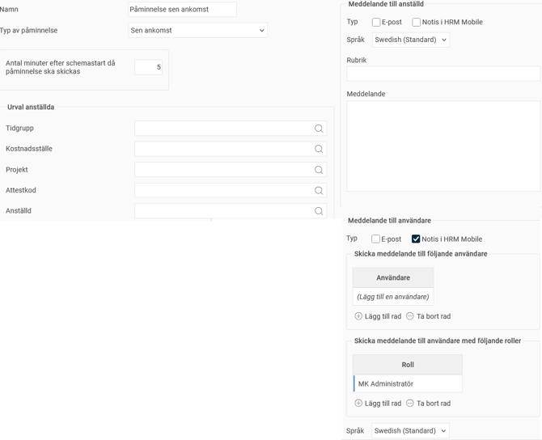
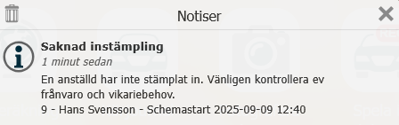

# ⚙️Kan jag få ett meddelande om en anställd inte stämplat in?

**Datum:** den 26 september 2025  
**Kategori:** Time  
**Underkategori:** Inställningar  
**Typ:** config  
**Svårighetsgrad:** intermediate  
**Tags:** frånvaro, mobil, ob, schema, stämpling  
**Bilder:** 2  
**URL:** https://knowledge.flexhrm.com/sv/kan-jag-f%C3%A5-ett-meddelande-om-en-anst%C3%A4lld-inte-st%C3%A4mplat-in

---

Beskrivning av påminnelsen för sen ankomst, med inställningar och exempel.
Få påminnelser om sen ankomst
Du kan få en notis och/eller ett e-postmeddelande om en anställd är schemalagd men inte har stämplat in eller gjort en frånvaroanmälan. Du ställer in det under
Inställningar > Allmänt > Påminnelser
. Påminnelsen kallas
Sen ankomst.

Så här ställer du in påminnelsen
Du kan välja att påminnelsen ska gälla för alla anställda, eller göra ett urval baserat på
tidgrupp
,
hemkonteringar
eller specifika
anställda
.
Under
Antal minuter efter schemastart då påminnelse ska skickas
anger du hur lång tid efter schemastart som meddelandet ska skickas ut. Schemastart avser den anställdas schemalagda starttid. Om den anställda har flextid är det flextidsfönstrets ”till och med”-tid som gäller.
Du kan också välja att få en påminnelse innan schemat startar genom att skriva ett minustecken (-) framför siffran. Om du till exempel skriver
-5
kommer påminnelsen att skickas fem minuter före schemastart/flexfönstrets "till och med"-tid.
Bestäm vem som ska få meddelandet
Meddelande till anställd
: Välj om den anställda som är sen ska få meddelandet.
Meddelande till användare
: Här kan du välja om en specifik användare eller alla användare med en viss roll för den asntällde, till exempel
Chef
, ska få meddelandet.
Påminnelsen kan skickas som
e-post
och/eller
notis i HRM Mobile
. Om ni använder flera språk i påminnelsen avgör mottagarens språkinställning vilket språk påminnelsen skickas på.
Exempel
Anställd 9 är schemalagd att börja kl 12:30, med möjlighet till flextid 12:20-12:40. Påminnelsen är inställd som på bilden ovan, 5 minuter efter schemastart.
Anställd 9 stämplar inte in.
Kl 12:45 kommer alla som har rollen MK Administratör för anställd 9 att få en notis i HRM Mobile som informerar om den saknade instämplingen.

Relaterat
Hur fungerar Påminnelser?
