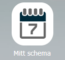
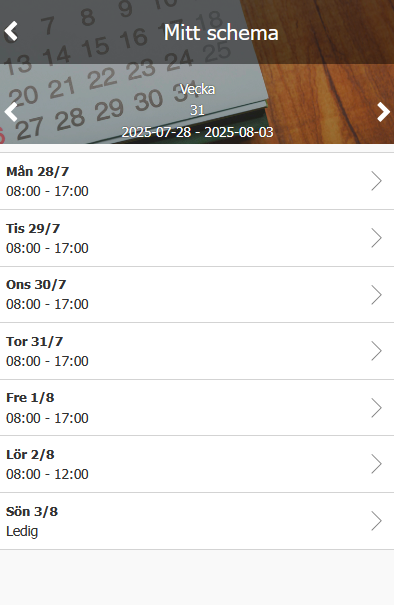
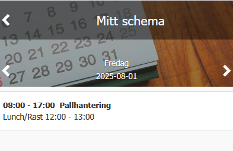

# Kan jag se information om mitt schema i HRM Mobile?

**Datum:** den 12 januari 2026  
**Kategori:** Time  
**Underkategori:** Schema & Planering  
**Typ:** faq  
**Svårighetsgrad:** intermediate  
**Tags:** mobil, ob, schema, övertid  
**Bilder:** 3  
**URL:** https://knowledge.flexhrm.com/sv/kan-jag-se-information-om-mitt-schema-i-mobilen

---

HRM Mobile - Mitt schema
I
HRM Mobile
finns vyn
Mitt schema.
Där visas schemat veckovis. Du kan bläddra mellan veckor med pilarna eller klicka på veckonumret för att välja ett annat.

Klicka på en dag för att se detaljer som raster, planering, planerad övertid.

