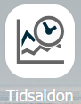
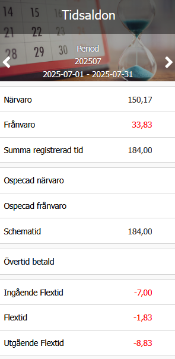

# Kan jag se mina saldon i HRM Mobile?

**Datum:** den 12 januari 2026  
**Kategori:** Time  
**Underkategori:** Mobil & Stämpling  
**Typ:** faq  
**Svårighetsgrad:** intermediate  
**Tags:** frånvaro, mobil, ob, saldo, schema, tidrapport  
**Bilder:** 2  
**URL:** https://knowledge.flexhrm.com/sv/kan-jag-se-mina-saldon-i-mobilen

---

HRM Mobile - Tidsaldon
I
HRM Mobile
, funktionen
Tidsaldon
ser du periodens summeringar. Samtliga periodsaldon som visas i tidrapporten i HRM visas också här. Du kan bläddra mellan perioder, eller klicka på inladdad period för att byta till en annan.

För att se varje dags saldon kan du använda daginformationen i funktionen
Tidrapport.
Relaterat:
Hur tidrapporterar jag i mobilen?
