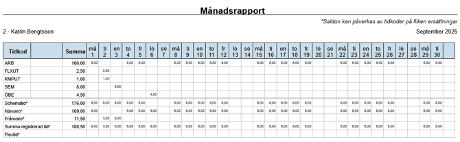
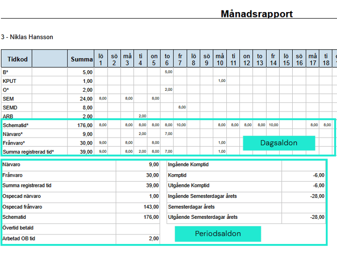
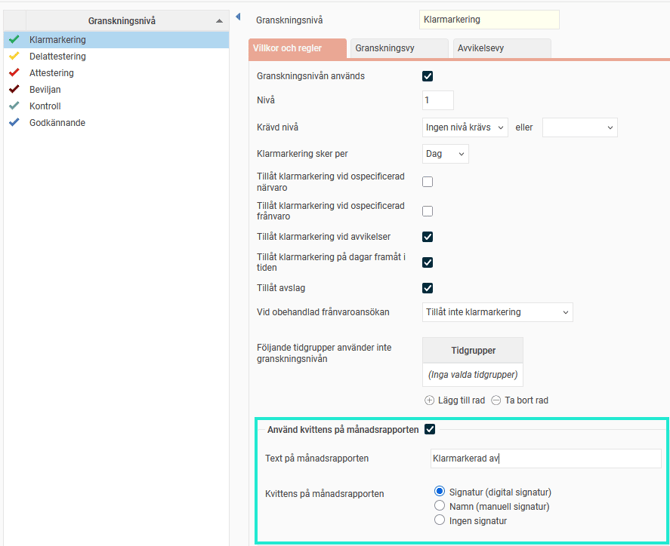
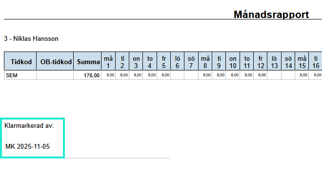

# Kan jag skriva ut min tidrapport?

**Datum:** den 18 december 2025  
**Kategori:** Time  
**Underkategori:** Tidrapportering  
**Typ:** faq  
**Svårighetsgrad:** intermediate  
**Tags:** lön, ob, saldo, tidkod, tidrapport  
**Bilder:** 4  
**URL:** https://knowledge.flexhrm.com/sv/kan-jag-skriva-ut-min-tidrapport

---

Månadsrapporten kan skrivas ut direkt från tidrapporten eller via vyn Rapporter.
Månadsrapporten ger dig en översikt över de tider du har matat in under en månad.

Du kan skriva ut månadsrapporten på två olika sätt: direkt från tidrapporten eller via vyn
Rapporter
.
1. Skriv ut från tidrapporten
För att skriva ut en månadsrapport direkt från tidrapporten:
Gå till
Mer
>
Skriv ut
.
Du kan välja att
gruppera
tiderna på
OB-tidkod
eller på en
kontering
.
Vid utskrift från tidr
apporten kommer dagsaldon och periodsaldon alltid med.
2. Skriv ut från vyn Rapporter
Du kan också ta ut Månadsrapporten från vyn
Rapporter
. Där har du möjlighet att göra fler urval:
Urval på anställda:
Välj enskilda
anställningsnummer
, eller gör urval via
tidgrupp
och/eller
hemkontering.
Datumurval:
Välj önskat datumintervall.
Överförda tider:
Välj om du vill ta ut samtliga tidrapporter, endast rapporter som är
överförda till lön
, eller rapporter som
inte är överförda till lön
.
Inställningar för utskriften
Precis som vid utskrift i tidrapporten kan du välja att
gruppera
på
OB-tidkod
eller på en
kontering
.
Om du väljer att gruppera kan du också välja att
OB-tidkodens/konteringens namn ska visas istället för dess kod
.
Du kan också välja om
dagsaldon
och
periodsaldon
ska skrivas ut.

Så fungerar gruppering
Visningsalternativet
Gruppera på
styr hur tidrader slås ihop och i vilken ordning de visas i Månadsrapporten.
Gruppera på OB/kontering:
Tidrader utan OB/kontering visas först.
Därefter visas raderna i bokstavsordning, baserat på OB-tidkodens/konteringens
kod
(eller benämning om du valt att visa benämning istället för kod).
Rader utan OB/kontering sorteras utifrån tidkodens
kod
.
Ingen gruppering:
Tidraderna visas i bokstavsordning, baserat på tidkodens
kod
.
Visa kvittens på utskriften
Du kan välja att visa vem eller vilka som har granskat tidrapporten på utskriften. Detta ställs in per granskningsnivå i systemet under
Inställningar
>
Allmänt
>
Granskningsnivåer
>
Tidrapporter
. Du ställer in om kvittens ska visas, och om det ska visas med användarens signatur eller med en rad för manuell signatur.

