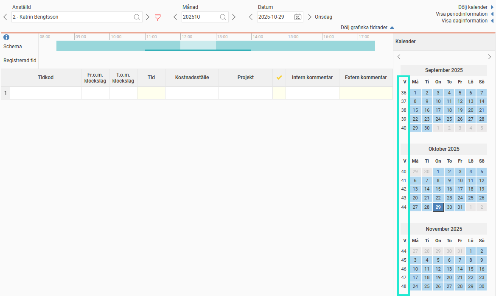

# Kan jag visa veckonummer i tidrapportens kalender?

**Datum:** den 29 oktober 2025  
**Kategori:** Time  
**Underkategori:** Tidrapportering  
**Typ:** faq  
**Svårighetsgrad:** beginner  
**Tags:** frånvaro, tidrapport  
**Bilder:** 1  
**URL:** https://knowledge.flexhrm.com/sv/kan-jag-visa-veckonummer-i-tidrapportens-kalender

---

Kalendern i din tidrapport är användbar när du ska välja datum för rapportering eller planera till exempel frånvaro.
Om du vill att kalendern ska visa
veckonummer
kan du göra en inställning för det.

Aktivera veckonummer i kalendern
Gå till menyn
Min profil > Språk och nationella inställningar
.
Markera kryssrutan
Visa veckonummer
.
När du har gjort inställningen kommer kalendern i tidrapporten att visa veckonummer.
