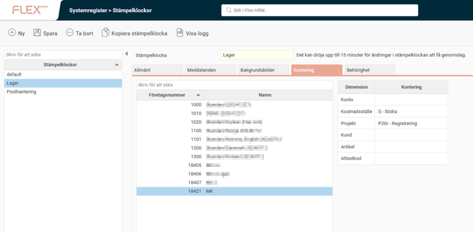

# ⚙️Kan konteringar falla ut automatiskt i tidrapporten beroende på vilken stämplingsterminal man använder?

**Datum:** den 26 september 2025  
**Kategori:** Time  
**Underkategori:** Mobil & Stämpling  
**Typ:** config  
**Svårighetsgrad:** intermediate  
**Tags:** stämpling, tidrapport  
**Bilder:** 1  
**URL:** https://knowledge.flexhrm.com/sv/kan-konteringar-falla-ut-automatiskt-i-tidrapporten-beroende-p%C3%A5-vilken-st%C3%A4mplingsterminal-man-anv%C3%A4nder

---

Under
Systemregister > Stämpelklockor
finns fliken
Kontering
där du kan koppla konteringar till stämpelklockor, det vill säga att ange att alla anställda som stämplar på en viss stämpelklocka automatiskt ska registreras på en viss kontering (t.ex. avdelning eller projekt).
Fliken
Kontering
visas på bilden nedan. Här väljer du per företag en eller flera konteringsdimensioner som ska läggas ut när en anställd stämplar in på just den klockan. Det innebär att istället för att de anställda manuellt stämplar konteringsbyte varje gång de går till en annan avdelning, så kan du placera en stämpelklocka på varje avdelning som de får stämpla in på.
Här har vi ställt in att tidrader från stämplingar som görs på klockan
Lager
av anställda i företag 18421 kommer att få kostnadsställe S och projekt P20r.

