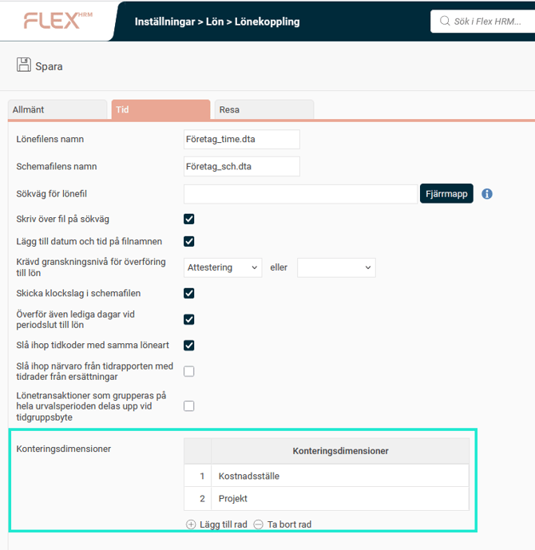
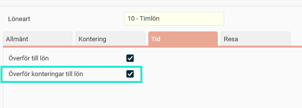

# ⚙️Kan konteringar från tidrapporten följa med till lönesystemet?

**Datum:** den 26 september 2025  
**Kategori:** Time  
**Underkategori:** Lön & Överföring  
**Typ:** config  
**Svårighetsgrad:** intermediate  
**Tags:** lön, tidrapport  
**Bilder:** 2  
**URL:** https://knowledge.flexhrm.com/sv/kan-konteringar-fr%C3%A5n-tidrapporten-f%C3%B6lja-med-till-l%C3%B6nesystemet

---

Under
Inställningar > Lön > Lönekoppling
ställer man in vilka konteringar (till exempel kostnadsställe eller projekt) som ska skickas till lönesystemet. Det handlar då om registrerad kontering från tidraderna, inte hemkonteringar.

Förutom den inställningen finns det en inställning per löneart där man kan undanta vissa lönearter från att skicka konteringar. Den finns under
Inställningar > Lön > Lönearter, fliken Tid: Överför konteringar till lön.

Får ni inte med t.ex. kostnadsställe i löneöverföringen?
Kontrollera först inställningarna för lönekopplingen. Är kostnadsställe inställt på att skickas till lön, kontrollera inställningen för en specifik löneart som är med i överföringen och där kostnadsställe finns i tidrapporten.
Relaterat
Hur överförs information från tidrapporterna till lönesystemet?
