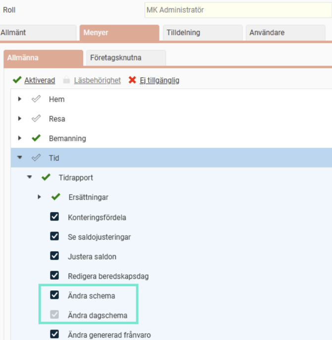
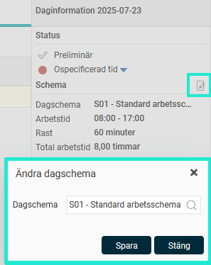
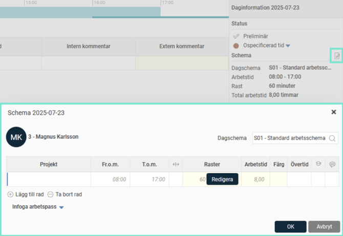
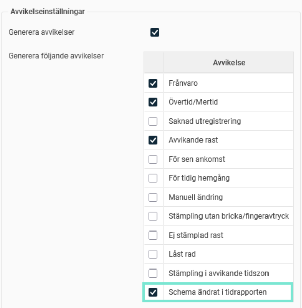
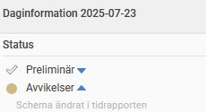

# ⚙️Kan man ändra ett schema direkt i tidrapporten?

**Datum:** den 26 september 2025  
**Kategori:** Time  
**Underkategori:** Inställningar  
**Typ:** config  
**Svårighetsgrad:** intermediate  
**Tags:** ob, schema, tidrapport, övertid  
**Bilder:** 5  
**URL:** https://knowledge.flexhrm.com/sv/kan-man-%C3%A4ndra-ett-schema-direkt-i-tidrapporten

---

Artikeln visar hur du ger anställda behörighet att ändra schema direkt i tidrapporten, samt hur du ställer in att en avvikelse ska genereras när schema ändras i tidrapporten.
Ändra schema i tidrapporten
Avvikelse när schema ändrats i tidrapporten
Ändra schema i tidrapporten
Schemat kan ändras direkt i tidrapporten utan att gå till Schema/Bemanning. Behörigheter styr vem som kan ändra och vad man kan ändra. En roll med behörighet
Ändra schema
kan ändra alla schemauppgifter (dagschema, klockslag etc). En roll med behörighet
Ändra dagschema
kan endast byta ut dagschemat.

I tidrapporten visas en ikon i daginformationen som du kan klicka på. Om du endast har  behörighet att ändra dagschema visas ett fönster där du kan välja dagschema.

Om du är behörig att ändra alla schemauppgifter får du upp en mer detaljerad popup när du klickar på  ikonen. Här kan man förutom dagschema justera arbetstid, flexramar, rasttider, samt planera övertid och skriva en kommentar. Om ni använder
HRM Plan
kan du också infoga arbetspass eller bemanna på en kontering.

Avvikelse när schema ändrats i tidrapporten
Det finns möjlighet att ställa in att en avvikelse genereras om schemat blivit förändrat från tidrapporten. Det kan vara bra om man som chef vill ge sina anställda behörighet att ändra sina egna scheman men när man attesterar ändå vill ha koll på vilka dagar som schemat ändrats på.
För att aktivera avvikelsen behöver du markera inställningen
Schema ändrat i tidrapporten
under Avvikelseinställningar, vilket kan göras på någon av följande nivåer:
företag (
Tidrapporter
)
tidgrupp (
Tidgrupper > fliken Tid
)
anställd (
Anställda > fliken Tid
)

I tidrapporten visas då en avvikelse om schemat är ändrat från tidrapporten. Observera att det är den senaste ändringen som avses. Det innebär att om schemat först ändrats från  tidrapporten och sedan ändras från Schema/Bemanning så kommer det inte att ge en  avvikelse.

