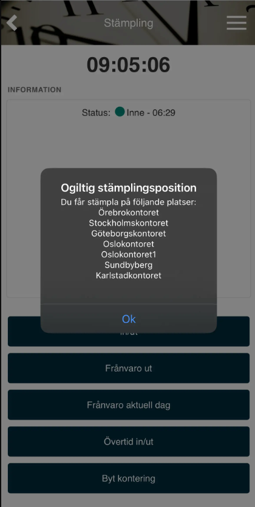
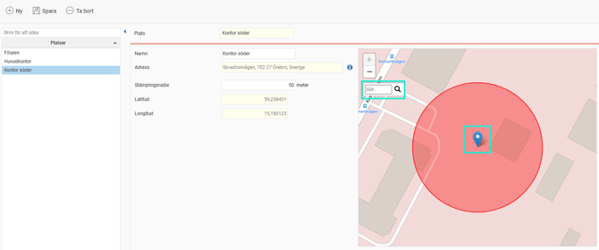
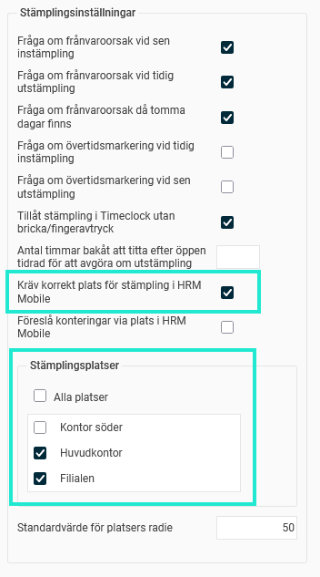

# ⚙️Kan man begränsa stämplingen i HRM Mobile via plats?

**Datum:** den 26 september 2025  
**Kategori:** Time  
**Underkategori:** Mobil & Stämpling  
**Typ:** config  
**Svårighetsgrad:** intermediate  
**Tags:** mobil, ob, stämpling, tidrapport  
**Bilder:** 3  
**URL:** https://knowledge.flexhrm.com/sv/kan-man-begr%C3%A4nsa-st%C3%A4mplingen-i-hrm-mobile-via-plats-

---

Artikeln informerar om att sätta upp ett platsregister i HRM och att begränsa stämplingar i HRM Mobile till dessa platser.
Du kan sätta upp ett platsregister under
Inställningar > Tid och Bemanning > Platser
och per
företag
,
tidgrupp
eller
anställd
ställa in att korrekt plats krävs för stämpling samt vilka platser som tillåts. Vid stämpling i HRM Mobile kontrolleras då mobilens plats. Är du inte på en korrekt plats får du ett meddelande som informerar om vilka stämplingspositioner du kan använda.

Observera
Användaren måste tillåta att HRM Mobile använder telefonens/enhetens platstjänster för att kunna stämpla när denna funktion används.
Ställa in Platser
Under
Inställningar > Tid och Bemanning > Platser
kan du skapa ett register över platser. Du kan använda kartnålen på kartan för att markera platsen, eller skriva in en adress i kartans sökruta.

Ställ in en stämplingsradie för att fånga upp stämplingar i närheten av platsen. Under
Inställningar > Tid och Bemanning > Tidrapporter
ställer du in ett standardvärde för stämplingsradie, som används om du inte anger ett avvikande värde för en specifik plats.
Ställa in tillåtna platser
Du kan per
företag
,
tidgrupp
eller
anställd
ange att plats ska kontrolleras vid stämpling, samt vilka platser som är tillåtna. Ställ in per företag under Inställningar > Tid och Bemanning > Tidrapporter, per tidgrupp under Inställningar > Tid och Bemanning > Tidgrupper, per anställd under Anställda > Tid.
Mest specifik nivå gäller. Har du i företagsinställningen angett att korrekt plats krävs, men för en tidgrupp angett att plats inte krävs kommer plats inte kontrolleras för anställda tillhörande denna tidgrupp.

Tips
Platser kan också användas för att HRM Mobile automatiskt ska välja t.ex. Projekt när du stämplar in eller stämplar konteringsbyte. Läs mer i denna artikel:
Stämpla i HRM Mobile med hjälp av plats
.
