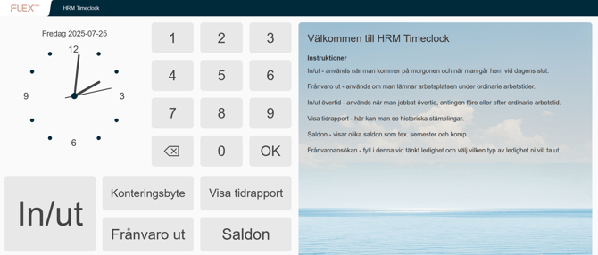

# ⚙️Kan man skicka meddelanden i stämpelklockan?

**Datum:** den 26 september 2025  
**Kategori:** Time  
**Underkategori:** Mobil & Stämpling  
**Typ:** config  
**Svårighetsgrad:** intermediate  
**Tags:** mobil, ob, stämpling  
**Bilder:** 2  
**URL:** https://knowledge.flexhrm.com/sv/kan-man-skicka-meddelanden-i-st%C3%A4mpelklockan

---

Observera
Denna artikel handlar endast om meddelanden som visas i stämpelklockor. För att skicka ett meddelande till alla användare i HRM/Mobile kan du använda funktionen
Meddelanden
som finns på startsidan i HRM och som en egen menyingång i HRM Mobile.
Under
Systemregister > Stämpelklockor > Meddelanden
kan du ändra välkomsttexten som visas när HRM Timeclock är inaktiv (när ingen stämplar). Standardtexten om du inte ändrar är ”Välkommen till HRM Timeclock”.
Du kan även lägga in andra meddelanden samt tidsbestämma när de ska visas.

Välkomsttext och meddelanden kommer att visas till höger i HRM Timeclock.

