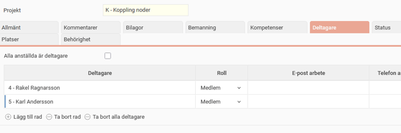
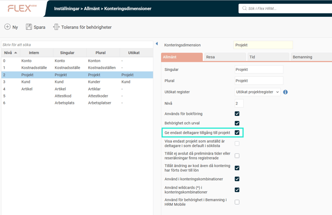
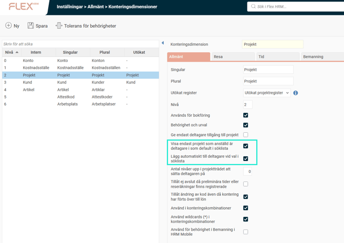
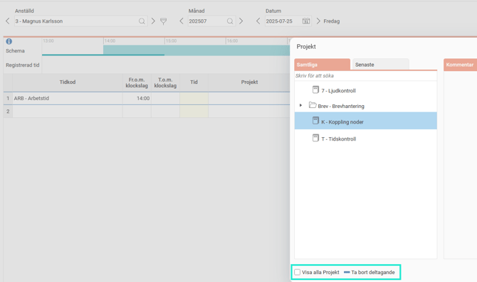

# ⚙️Kan man ställa in så att användare endast ser vissa projekt i sin tidrapport?

**Datum:** den 29 september 2025  
**Kategori:** Time  
**Underkategori:** Inställningar  
**Typ:** config  
**Svårighetsgrad:** intermediate  
**Tags:** tidrapport  
**Bilder:** 4  
**URL:** https://knowledge.flexhrm.com/sv/kan-man-st%C3%A4lla-in-s%C3%A5-att-anv%C3%A4ndare-endast-ser-vissa-projekt-i-sin-tidrapport

---

Projektdeltagare kan användas för att begränsa antal projekt som visas för användaren.
Projektregistret kan vara omfattande. Om man endast rapporterar tid på vissa projekt kan det underlätta att endast se dessa, och inte alla företagets projekt, i sin tidrapport.
I
projektregistret
kan man ställa in
deltagare
för projekt.

I
konteringsdimensionsinställningarna
kan man välja att
endast deltagare har tillgång till projekt
. Det innebär att man i sin tidrapport endast kan använda sådana projekt som man står som deltagare i, eller där alla anställda är deltagare.

Om man inte vill begränsa så hårt, utan bara underlätta för de anställda att se “sina” projekt kan man istället använda
Visa endast projekt som anställd är deltagare i som default i söklista.

Man ser då endast sina projekt, men kan välja att visa alla.
Man kan kombinera detta med inställningen att man läggs till i de projekt man väljer, så att de vid kommande tillfällen kommer att visas som default (
Lägg automatiskt till deltagare vid val i söklista
).
Med detta får man också möjligheten att plocka bort sig som deltagare, så att man fortsatt inte behöver se det projektet som default. Det fungerar inte för projekt som har inställt att alla anställda är deltagare.

