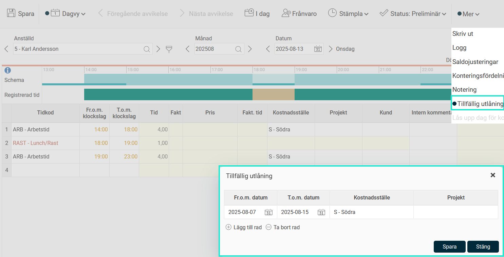

# Kan tidrapporten tillfälligt lägga ut ett annat kostnadsställe än mitt hemkostnadsställe?

**Datum:** den 19 augusti 2025  
**Kategori:** Time  
**Underkategori:** Tidrapportering  
**Typ:** faq  
**Svårighetsgrad:** intermediate  
**Tags:** tidrapport  
**Bilder:** 1  
**URL:** https://knowledge.flexhrm.com/sv/kan-tidrapporten-tillf%C3%A4lligt-l%C3%A4gga-ut-ett-annat-kostnadsst%C3%A4lle-%C3%A4n-mitt-hemkostnadsst%C3%A4lle

---

Tillfällig utlåning
kan användas om du under en begränsad period vill att en eller flera konteringar (t.ex. kostnadsställe, projekt etc.) ska läggas ut på tidraderna i tidrapporten.
Du hittar Tillfällig utlåning under
Mer
-menyn i tidrapporten. Ange datumintervall och önskade konteringar. Dessa konteringar kommer att läggas ut i tidrapporten, om ingen annan kontering angetts.

En rund ikon i menyn, som på bilden, indikerar att det finns en tillfällig utlåning inlagd under inladdat datum/datumintervall.
Relaterat:
Inställning och behörighet för tillfällig utlåning.
