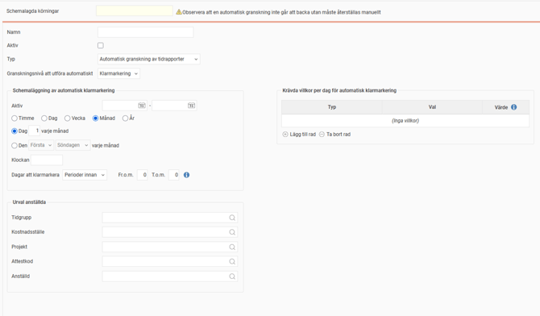
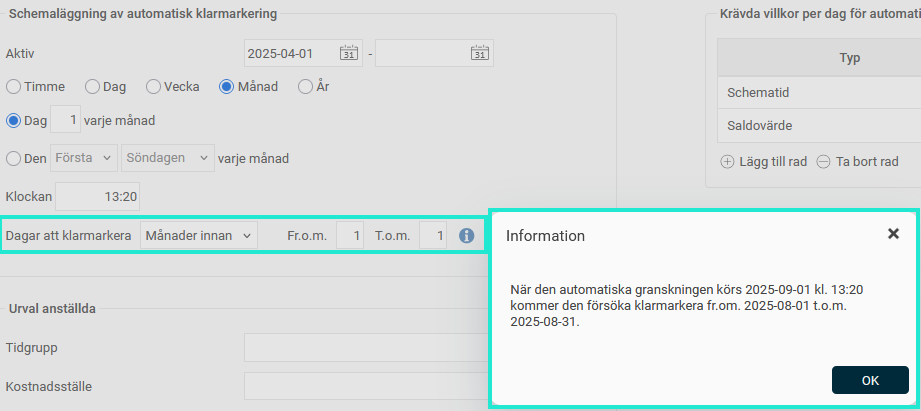
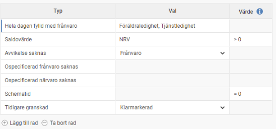
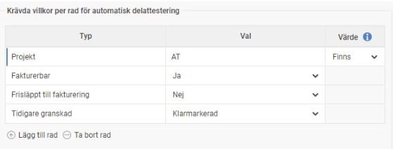
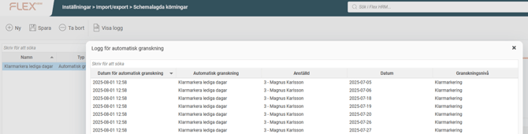
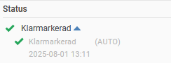
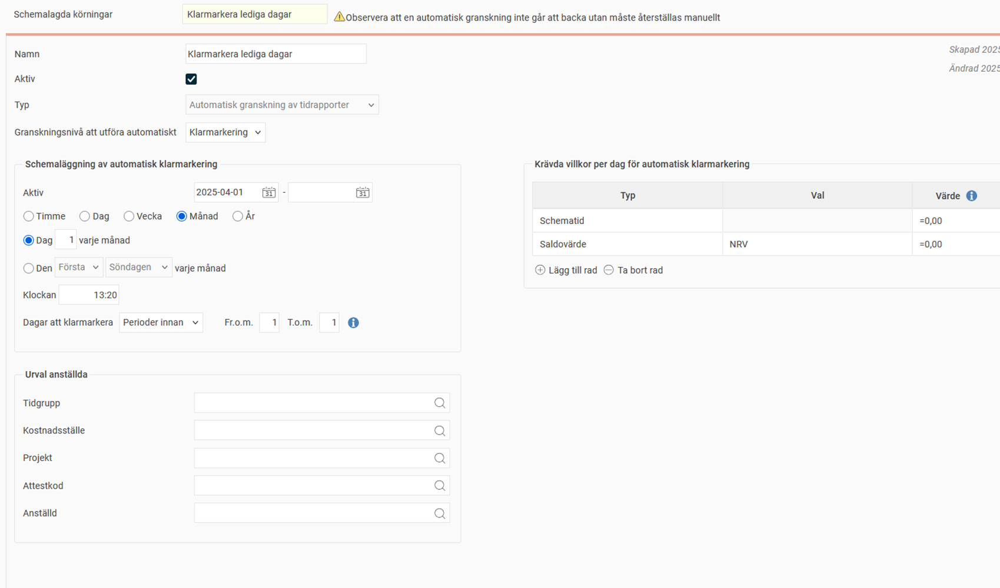
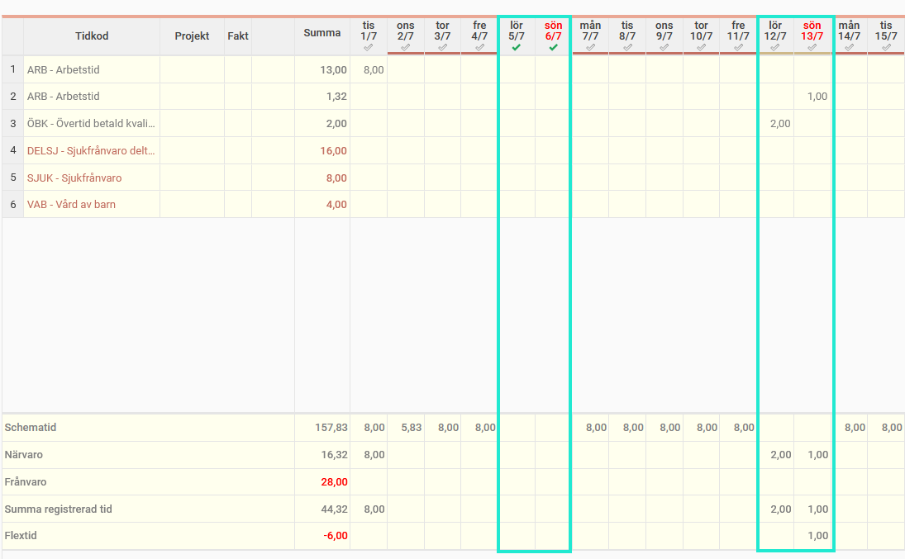

# ⚙️Kan tidrapporter granskas automatiskt?

**Datum:** den 26 september 2025  
**Kategori:** Time  
**Underkategori:** Attestering & Granskning  
**Typ:** config  
**Svårighetsgrad:** intermediate  
**Tags:** attestering, frånvaro, lön, ob, saldo, schema, tidrapport  
**Bilder:** 8  
**URL:** https://knowledge.flexhrm.com/sv/kan-tidrapporter-granskas-automatiskt

---

Granskning av tidrapporter (klarmarkering, attestering etc) är en kontroll för att uppgifterna ska vara korrekta, till lön och för statistik.
Det finns dock tillfällen där du kan vilja automatisera granskningen för att minska medarbetarnas och/eller chefernas manuella arbete.
D
et kan t.ex. handla o
m:
a
utom
atisk klarmarkering av tidrapporter för anställda som har föräldraledighet
automatisk klarmarkering av lediga dagar utan rapporterad tid
automatisk delattestering av vissa interna projekt
automatisk attestering av tidrapporter utan avvikelser
Under
Administration > Inställningar > Import/export > Schemalagda körningar
finns en körning som heter
Automatisk granskning av tidrapporter.
Där väljer du vilken granskningsnivå det gäller, när den ska köras och hur långt bakåt i tiden den ska köra.

Tips!
Info-ikonen hjälper dig att schemalägga körningen. Klicka på den för att få mer detaljerad information om hur körningen kommer att göras.

Du kan göra urval på anställda, t.ex. bara en viss tidgrupp. Sedan väljer du vilka villkor som ska vara uppfyllda för automatisk granskning av en dag.

Villkoren som kan göras är:
Hela dagen fylld med frånvaro.
Villkoret kan gälla en eller flera frånvaroorsaker.
Saldovärde.
K
an gälla ett eller flera saldon.
Avvikelse saknas.
K
an gälla en vald avvikelse. Använd flera rader om du vill sätta villkor för flera avvikelser.
Ospecificerad frånvaro/närvaro saknas.
Schematid.
Tidigare granskad,
t.ex. Klarmarkerad.
För
Saldovärde
och
Schematid
måste villkoret ha ett värde. Det kan exempelvis vara "=0" för att säga att en dag som ska granskas inte får ha schematid.
I de fall granskningsnivån är inställd på att granskas per tidrad (ofta kallat delattest) tillkommer även ett antal villkor du kan ställa in som ska vara uppfyllda per tidrad för att den tidraden ska bli delattesterad: kontering, fakturerbar, frisläppt.

I menyn i
Schemalagda körningar
finns en logg där du kan söka fram vad som blivit granskat automatiskt.

Signaturen (AUTO) visas i tidrapporten när granskningen inte gjorts av en användare utan genom denna automatiska granskning.

Exempel
Den schemalagda körningen på bilden är inställd på att dag 1 varje månad kontrollera föregående månad och klarmarkera de dagar som saknar schematid och där det inte finns någon registrerad närvaro.

När körningen görs 1 augusti klarmarkeras 5 och 6 juli som är lediga dagar. 12 och 13 juli klarmarkeras inte. De är också lediga dagar, men har registrerad närvaro.

Observera
Automatisk granskning går inte att backa. Ska den återställas behöver det göras manuellt.
