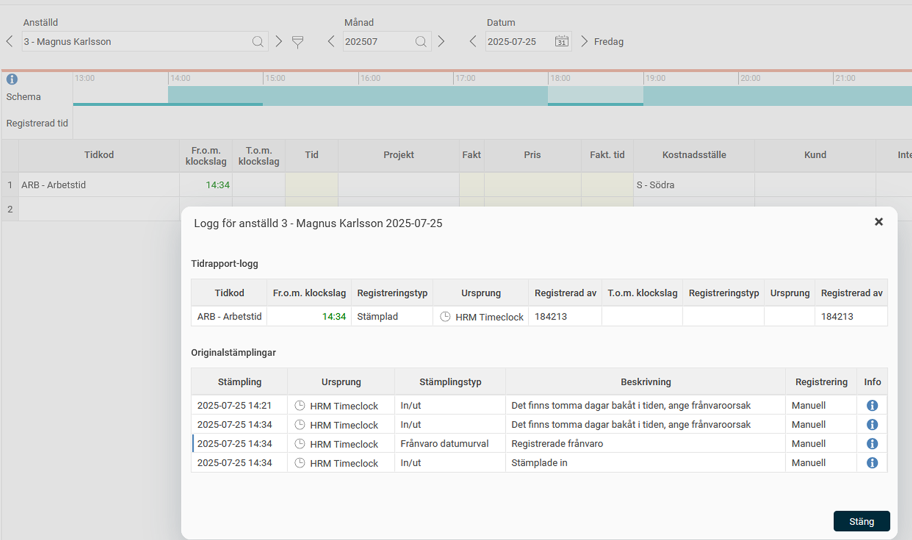

# Loggas stämplingar som görs i HRM Timeclock?

**Datum:** den 22 augusti 2025  
**Kategori:** Time  
**Underkategori:** Mobil & Stämpling  
**Typ:** other  
**Svårighetsgrad:** intermediate  
**Tags:** frånvaro, hrm-time, stämpling, tidrapport  
**Bilder:** 1  
**URL:** https://knowledge.flexhrm.com/sv/loggas-st%C3%A4mplingar-som-g%C3%B6rs-i-hrm-timeclock

---

Det finns en logg i tidrapporten där man kan se information om dagens stämplingar. Den finns i
Dagvyn
, under
Mer > Logg.
På bilden nedan kan man se att den anställde har stämplat kl 14:21 och fått en fråga om att ange frånvaroorsak, men inte svarat på denna vilket har avbrutit instämplingen. Kl 14:34 har den anställde stämplat igen och besvarat frågan. Frånvaro har lagts ut och instämpling har gjorts.

Under
Systemregister > Stämpelklockor
finns knappen
Visa logg
som ger en mer omfattande logg för stämplingar gjorda i HRM Timeclock. Loggen är främst avsedd för felsökning och för att kunna se vad som hänt på de olika stämpelklockorna. I urvalet kan du söka på tidsintervall, företag och stämpelklocka och få fram de loggposter som matchar det urvalet.
