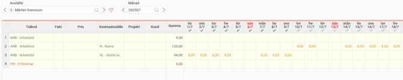
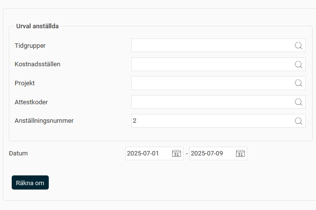
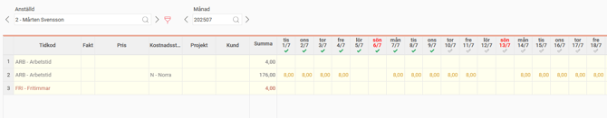

# Omräkning av tidrapporter - Hur kan ändringar få genomslag i granskade tidrapporter?

**Datum:** den 18 augusti 2025  
**Kategori:** Time  
**Underkategori:** Övertid & Ersättning  
**Typ:** other  
**Svårighetsgrad:** advanced  
**Tags:** lön, ob, schema, stämpling, tidrapport, övertid  
**Bilder:** 3  
**URL:** https://knowledge.flexhrm.com/sv/omr%C3%A4kning-av-tidrapporter-hur-kan-%C3%A4ndringar-f%C3%A5-genomslag-i-granskade-tidrapporter

---

Granskade tidrapporter kan räknas om för att ta del av ändrade inställningar.
Har du gjort en ändring i inställningarna, kanske i ett övertidsregelverk eller hemkonteringar, och vill att det ska få genomslag i tidrapporterna, även om de hunnit klarmarkeras? Använd då funktionen
Omräkning av tidrapporter.
Tidrapportdagar som inte granskats kommer att ta del av ändringen utan omräkning. Dagar som överförts till lön kommer inte att räknas om.
Det som räknas om är tidraderna utifrån gällande regelverk för t.ex. övertid, ob och stämplingstoleranser. Även genererade rader på ersättningar från händelser kommer att räknas om. Observera att redan stämplade tider inte kommer att påverkas, vilket innebär att t.ex. en utstämpling till rast fortfarande kommer att vara en utstämpling till rast även om schemat nu säger att det inte finns någon rast där.
Exempel
Hem
kostnadsställe läggs u
t i tidrapporterna. Anställd 2 har klarmarkerat sin tidrapport för de första nio dagarna i juli. Jag ändrar hans hemkostnadsställe i efterhand, och vill att det ska få genomslag fr.o.m. 1 juli. Dagarna från 10 juli ändras automatiskt då de inte är granskade, men 1-9 juli ligger kvar på det tidigare hemkostnadsstället.

Under
Bearbetningar > Servicerutiner > Omräkning av tidrapporter
gör jag urval på anställd 2 och 1-9 juli.

En notis visas när omräkningen är klar. Tidrapporten visar nu det nya hemkostnadsstället från 1 juli, utan att jag behövt ta bort klarmarkeringen som anställd 2 gjort.

