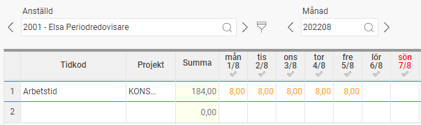
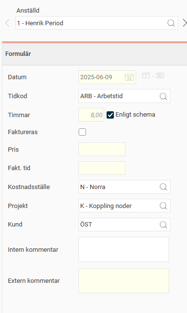
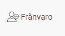
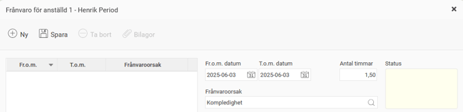
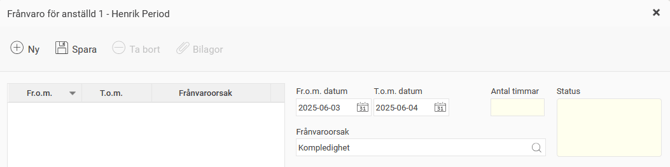
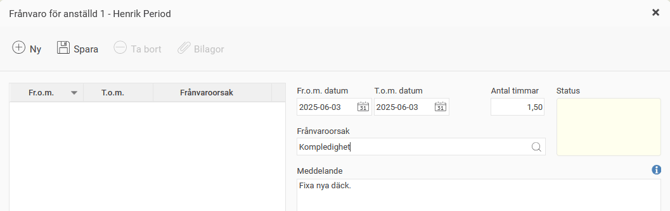
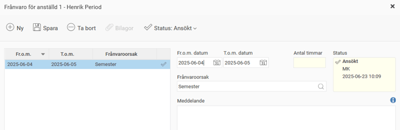
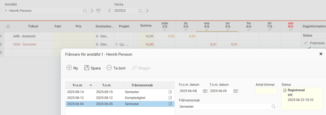
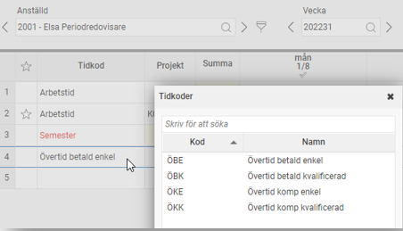
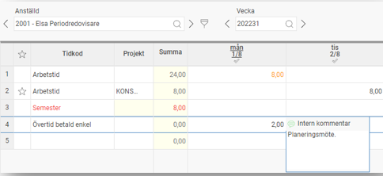

# Periodredovisning - Hur registrerar man närvaro, frånvaro och övertid som periodredovisare?

**Datum:** den 26 september 2025  
**Kategori:** Time  
**Underkategori:** Tidrapportering  
**Typ:** other  
**Svårighetsgrad:** intermediate  
**Tags:** frånvaro, ob, schema, tidkod, tidrapport, övertid  
**Bilder:** 10  
**URL:** https://knowledge.flexhrm.com/sv/periodredovisning-hur-registrerar-man-n%C3%A4rvaro-fr%C3%A5nvaro-och-%C3%B6vertid-f%C3%B6r-en-period

---

Registrera tid i tidrapporten – periodredovisning
Att
periodredovisa
innebär att du inte jobbar med klockslag, endast antal timmar. Som periodredovisare kan du själv välja om du vill rapportera tiden i
veckovyn
eller
månadsvyn
, det fungerar likadant i båda vyerna.
De som
dagredovisar
arbetar i
dagvyn
och registrering av tid sker med klockslag.
Läs mer om att registrera tid med dagredovisning.
Registrera närvaro
Registrera närvaro via formulär
Registrera frånvaro
Registrera övertid
Registrera närvaro
Markera fältet Tidkod på en tom rad. Klicka på tab och arbetskoden faller ut. Fyll sedan i antal timmar per dag.

Spara.
Registrera närvaro via formulär
Klicka på
Registrera via formulär.
Välj datum eller datumintervall. Om du vill rapportera in samma sak på flera dagar kan du göra det genom att ange datumintervall.
Välj antal timmar eller enligt schema. Väljer du att markera Enligt schema kommer det antal timmar du är schemalagd den dagen att läggas ut.
Välj kontering, t.ex. projekt.
Om du på en dag först rapporterar t.ex. 2 timmar på ett projekt och senare rapporterar 3 timmar på exakt samma projekt så kommer de att slås ihop till 5 timmar.
Tryck på
Spara
.
För att korrigera en inmatning markerar du raden och trycker på
Ta bort
.

Registrera frånvaro
Klicka på frånvarohanteraren:

Vid frånvaro del av dag, ange datum och antal timmar samt välj frånvaroorsak:

Vid heldagar anges endast datum. Gäller frånvaron flera dagar är det inte möjligt att justera antal timmar.

Möjlighet finns att lämna ett meddelande för att förklara frånvaron:

Spara.
Om frånvaron först måste godkännas kommer den att få status
Ansökt
och gå vidare till din chef. Så snart frånvaron är godkänd kommer den att genereras ut i tidrapporten.

Om frånvaron inte behöver godkännas kommer den att få status
Registrerad
och synas i din tidrapport direkt.

Registrera övertid
Markera tidkodsfältet på en tom rad och sök på Övertid.

Välj rätt typ och fyll i antal övertidstimmar för rätt dag.

Det finns även möjlighet att lämna en kommentar till övertiden.
Spara.
