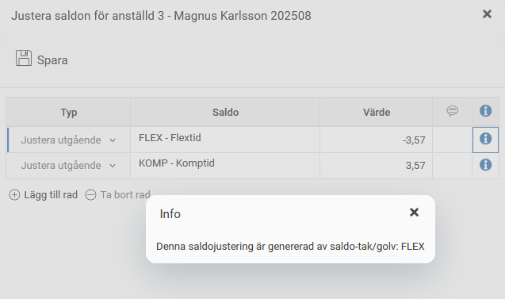
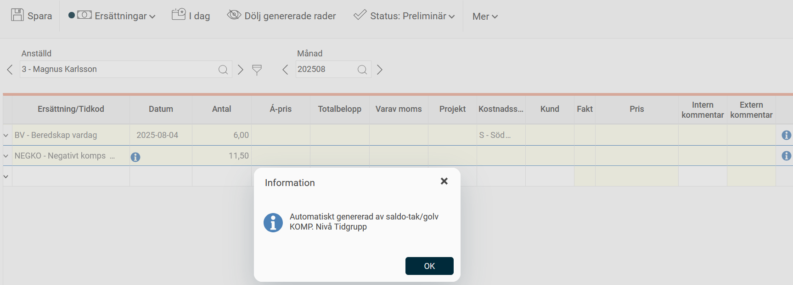

# ⚙️Saldotak/-golv - Hur sätter man gränser för saldovärden?

**Datum:** den 26 september 2025  
**Kategori:** Time  
**Underkategori:** Tidrapportering  
**Typ:** config  
**Svårighetsgrad:** intermediate  
**Tags:** frånvaro, lön, saldo, tidkod, tidrapport  
**Bilder:** 3  
**URL:** https://knowledge.flexhrm.com/sv/saldotak/-golv-hur-s%C3%A4tter-man-gr%C3%A4nser-f%C3%B6r-saldov%C3%A4rden

---

Saldotak/-golv
används för att sätta ett tak och/eller golv för saldon, och ange vad som ska hända om man går över taket/under golvet.
Det går att ställa in saldotak/-golv på företags-, tidgrupps- eller anställdnivå. Det mest specifika gäller. Skulle det finnas en inställning för samma saldo på tidrapports-, tidgrupps- och anställdnivå gäller den inställning som ligger på anställdnivå.
Endast rullande saldon kan få saldotak/-golv. Detta eftersom brytet görs vid början eller slutet av en period, då bryts ändå periodbundna saldon.
Exempel
I exemplet nedan är taket för både flex och komp 30 timmar, golvet är -10.
Om jag tjänar in eller tar ut för mycket flex ska jag istället få/ta från komp. Om jag skulle gå över 30 timmar komp läggs överskjutande timmar på en tidkod som är kopplad till en löneart som ger ersättning. Går man under -10 i kompsaldot läggs det istället på en tidkod som kommer att generera ett löneavdrag.
Det är viktigt att flex-saldotak/golv kommer först i ordningen, annars skulle flödet inte fungera som tänkt.
Det är också viktigt att använda minustecken, då golvet kan sättas till ett positivt värde.

Tidkoderna som används för justering brukar vara odefinierade, för att de inte ska ge extra närvaro eller frånvaro. Lönearterna som skickar över justeringen till lön ska inte vara kopplade till en frånvaroorsak. Man vill ha ett avdrag i lön, inte en frånvaro för det kommer att ställa till det i kalendariet.
När saldotak/golv slagit in syns det i tidrapporten under
Saldojusteringar
. Info-ikonen informerar om att justeringen kommer från saldotak/-golv.
Bilden nedan visar resultatet när flexsaldot har gått över taket. Ett flexsaldo på 33,57 timmar har justerats ner till 30, och 3,57 timmar lades då till kompsaldot.

När justeringen läggs till en tidkod visas denna i tidrapporten på fliken
Ersättningar
. Där ser man på vilken nivå saldotak/-golvinställningen är upplagd så att man kan spåra den.

Relaterade artiklar
Hur ställer man in tidkoder?
Hur ställer man in saldon?
