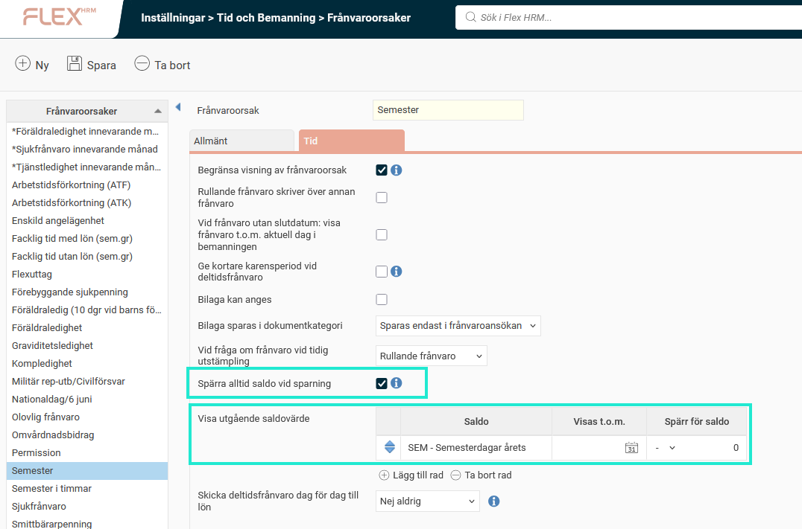

# ⚙️Spärr för saldo - Kan man spärra semesteransökningar om det inte finns tillräckligt många semesterdagar att ta ut?

**Datum:** den 26 september 2025  
**Kategori:** Time  
**Underkategori:** Frånvaro & Semester  
**Typ:** config  
**Svårighetsgrad:** intermediate  
**Tags:** frånvaro, ob, saldo, semester, stämpling  
**Bilder:** 2  
**URL:** https://knowledge.flexhrm.com/sv/sp%C3%A4rr-f%C3%B6r-saldo-kan-man-sp%C3%A4rra-semesterans%C3%B6kningar-om-det-inte-finns-tillr%C3%A4ckligt-m%C3%A5nga-semesterdagar-att-ta-ut

---

Under
Inställningar > Tid och Bemanning > Frånvaroorsaker
kan man ställa in
Spärr för saldo.
Spärr för saldo är till för att man inte ska kunna registrera/godkänna frånvaro om den skulle innebära att saldot får minusvärde.
Exempel
Bilde
n nedan visar frånvaroorsak
Semester.
Den är inställd på att i frånvarohanteraren visa utgående saldovärde för saldot SEM, och att spärra vid värde 0.
Spärra alltid saldo vid sparning
är ibockat.

Anställd 5 har 10 dagar i sitt semestersaldo. Om han försöker ansöka om 14 dagar semester får han ett felmeddelande som informerar om varför det inte går att spara.

Observera
Inställningen ställs in per
frånvaroorsak
, det är alltså inte en
saldoinställning
. Saldot kan få minusvärde, det spärras inte. Man spärrar bara att det ska få minusvärde pga en viss frånvaroorsak.
Spärren slår in vid:
Registrering i
frånvarohanteraren
, om man inte behöver godkänna ansökan. Om ansökan behöver godkännas slår spärren in vid godkännande. Det finns en inställning som gör att spärren slår in redan vid ansökan om ett godkännande skulle leda till att man bryter mot saldospärren:
Spärra alltid saldo vid sparning
.
Import
av frånvaro.
Stämpling
av frånvaro.
Man kan inte använda rullande frånvaro (frånvaro utan slutdatum) för en frånvaroorsak som använder spärr för saldo. Detta eftersom man inte vet hur länge frånvaron kommer att vara. Man kan alltså inte stämpla ut rullande flex även om man har 200 timmar plus i saldot.
⚠️
Kombinera inte saldospärr med saldotak/-golv. Ni kanske i HRM Time har ställt in saldotak/-golv i en kedja för semester, så att man först tar från årets semester, sedan sparad osv. Det fungerar inte i kombination med spärr för saldo.
Relaterade artiklar:
Hur ställer man in saldon?
Vad är en frånvaroorsak?
Saldotak/-golv
