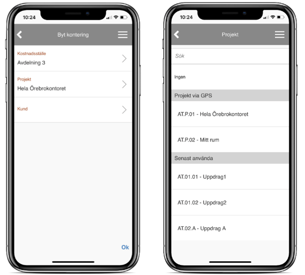
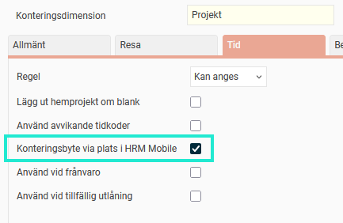
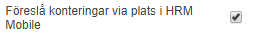
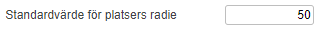

# ⚙️Stämpla i HRM Mobile med hjälp av plats

**Datum:** den 26 september 2025  
**Kategori:** Time  
**Underkategori:** Mobil & Stämpling  
**Typ:** config  
**Svårighetsgrad:** intermediate  
**Tags:** mobil, ob, stämpling, tidrapport  
**Bilder:** 5  
**URL:** https://knowledge.flexhrm.com/sv/st%C3%A4mpla-i-hrm-mobile-med-hj%C3%A4lp-av-plats

---

HRM Mobile kan lägga ut konteringar i tidrapporten baserat på plats. Artikeln beskriver hur det går till och vilka inställningar som behöver göras för att använda funktionen.
Stämpling
Inställningar
Vid stämpling i HRM Mobile kan du få hjälp att stämpla på rätt kontering, baserat på platsen där du befinner dig. Genom att ange platser för t.ex. olika  projekt kan HRM Mobile sedan automatiskt välja rätt projekt när du stämplar in/konteringsbyte.
Observera
Här använder vi begreppet projekt, men det kan lika gärna vara kostnadsställe, kund, uppdrag eller någon annan kontering.
Stämpling
När du stämplar in/konteringsbyte i HRM Mobile och din aktuella plats matchar ett projekt kommer det projektet automatiskt att väljas. Skulle din aktuella plats matcha flera projekt kommer de att visas som förslag när du väljer projekt (bilden till höger nedan).

Inställningar
Funktionen aktiveras per konteringsdimension under
Inställningar > Allmänt > Konteringsdimensioner > Fliken Tid: Konteringsbyte via plats i HRM Mobile.

Du väljer vilka anställda som ska beröras av denna funktion genom att markera inställningen
Föreslå konteringar via plats i HRM Mobile
, antingen för
hela företaget
(Inställningar > Tid och Bemanning > Tidrapporter), för
en eller flera tidgrupper
(Inställningar > Tid och Bemanning > Tidgrupper) eller
för specifika anställda
(Anställda > Tid).

Vidare anger du en eller flera platser för de olika projekten,
Register > Projekt
. En plats anges antingen genom att du väljer en redan upplagd plats (under
Inställningar > Tid och Bemanning > Platser
) eller pekar ut en plats på kartan. Det finns även möjlighet att importera platser till konteringsregistret.

Du kan ange hur många meters radie som ska accepteras för att avgöra om en anställd är på platsen. Väljer du ingen radie används ett standardvärde. Du kan kan ställa in standardvärdet under
Inställningar > Tid och Bemanning > Tidrapporter.

