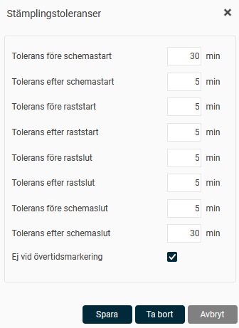
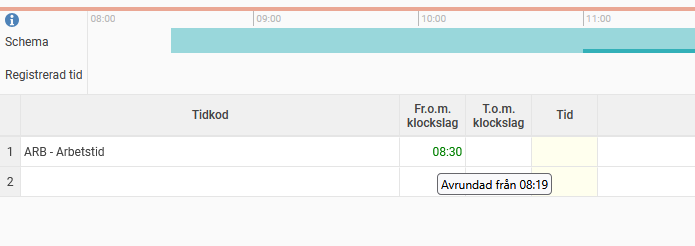

# ⚙️Stämplingstolerans - Kan man avrunda stämplingar?

**Datum:** den 26 september 2025  
**Kategori:** Time  
**Underkategori:** Inställningar  
**Typ:** config  
**Svårighetsgrad:** intermediate  
**Tags:** ob, schema, stämpling, tidrapport, övertid  
**Bilder:** 2  
**URL:** https://knowledge.flexhrm.com/sv/t%C3%A4mplingstolerans-kan-man-avrunda-st%C3%A4mplingar

---

Det går att använda
stämplingstoleranser
för att stämplad tid ska avrundas till schematid, eller till flexramen om ni använder flextid.
Ett exempel på användningsområde kan vara när flextid inte används men ni inte vill få ospecificerad tid så fort en anställd har stämplat in några minuter för sent eller för tidigt.
Stämplingstoleranser kan ställas in per
dagschema
, per
tidgrupp
eller på
företagsnivå
(under Tidrapporter). Mest specifik nivå gäller. Har du ställt in stämplingstoleranser på alla nivåer (dagschema, tidgrupp och företag) gäller endast dagschemats stämplingstoleranser.

Tolerans före/efter
Ange hur många minuter före och/eller efter en händelse (schemastart, raststart, rastslut och schemaslut) som stämpling ska tillåtas. En stämpling som görs inom intervallet kommer i tidrapporten att visas med händelsens klockslag, exempelvis kl. 08:00 om schemastart är då.
Om flexramar används anpassas toleranser efter det. Ett schema med schemastart 08:00 och flexram fr.o.m. 07:00 skulle hantera “Tolerans före schemastart” som tiden före 07:00.
Ej vid övertidsmarkering
Markera här om stämplingarna inte ska ändras om den anställde har gjort en övertidsmarkering.
Exempel
Vi använder stämplingstoleranserna på bilden ovan, 30 minuter före schemastart.
Ett dagschema har arbetstid från 08:30, inga flexramar.
1: Anställd 1 stämplar in kl 07:00. Tiden i tidrapporten blir 07:00, eftersom stämplingstoleransen inte börjat gälla.
2: Anställd 1 stämplar in kl 08:19. Tiden avrundas till 08:30.
Tips
Hovra över klockslaget i tidrapporten för att se faktiskt stämplad tid. Det går också att se den faktiskt stämplade tiden under
Mer > Logg
.

Observera
Detta är en
stämplings
tolerans. Endast stämplade tider kan avrundas. Manuellt angivna tider gäller, även om de faller inom ramen för stämplingstolerans.
