# ⚙️Tidkodsavrundning - Varför avrundas rapporterad tid?

**Datum:** den 29 september 2025  
**Kategori:** Time  
**Underkategori:** Övertid & Ersättning  
**Typ:** config  
**Svårighetsgrad:** advanced  
**Tags:** lön, ob, saldo, tidkod, tidrapport, övertid  
**Bilder:** 11  
**URL:** https://knowledge.flexhrm.com/sv/tidkodsavrundning-varf%C3%B6r-avrundas-min-rapporterade-tid-i-saldot

---

Tidkodsavrundning används för att avrunda registrering av vissa tidkoder. Det handlar ofta om övertid som ska avrundas till jämna halvtimmar.
Denna artikel förklarar vad inställningarna i vyn tidkodsavrundning innebär samt ger exempel på utfall av tidkodsavrundning.
Inställningar i vyn Tidkodsavrundning
Exempel med utfall i tidrapport
Tidkodsavrundning används för att avrunda registrering av vissa tidkoder.
Det handlar of
ta om övertid som s
ka avrundas till jämna halvtimmar. Regelverket för tidkodsavrundning bestämmer hur avrundningen ska ske och om tid som avrundats bort/lagts till ska läggas till/tas från en annan tidkod.
Tidkodsavrundningen syns aldrig på tidraderna i tidrapporten. Tidkodsavrundningar syns i saldon och i överföringen till lön.
Inställningar i vyn Tidkodsavrundning
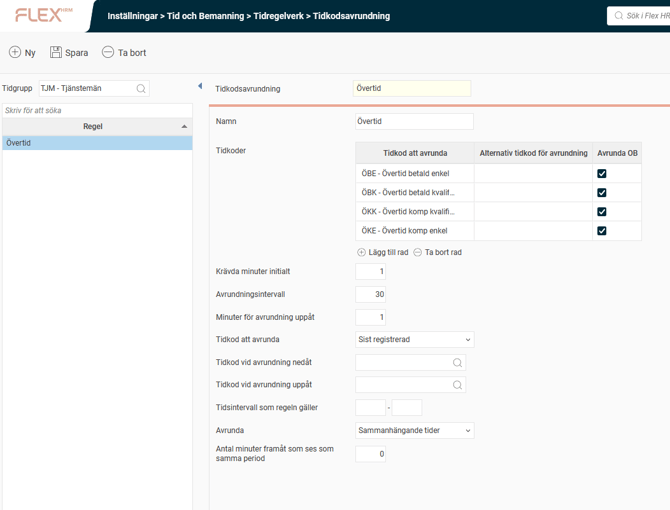
Tidkod att avrunda
H
är kan du ange en tidkod som ska avrundas, eller flera tidkoder om de ska avrundas tillsammans.
Exempel:
Övertid ska avrundas uppåt till närmaste halvtimme.
Alternativ 1:
Jag gör en separat inställning för tidkodsavrundning för tidkoden ÖB1, och en separat inställning  för tidkodsavrundning för tidkoden ÖB2.
Jag registrerar 15 minuter ÖB1 och 15 minuter ÖB2.
Resultat: 30 minuter ÖB1 och 30 minuter ÖB2.
Alternativ 2:
Jag gör endast en inställning för tidkodsavrundning där både ÖB1 och ÖB2 ingår.
Jag registrerar 15 minuter ÖB1 och 15 minuter ÖB2.
Resultat: Ingen avrundning då ÖB1 + ÖB2 blir 30 minuter, vilket inte ska avrundas.
Alternativ tidkod för avrundning
Användbart om den avrundade dele
n av ska separeras från den faktiskt arbetade tiden för att undvika att blanda ihop vad som arbetats och vad som blivit en ren ersättning.
Avrunda OB
Tidkodsavrundning är egentligen en tid
rad
savrundning vilket gör att OB kan avrundas även om regeln egentligen gäller tidradens huvudtidkod.
Krävda minuter initialt
Det antal minuter du minst måste registrera för att tid ska falla ut.
Avrundningsintervall
D
e
t
a
n
tal minuter som
tiden ska avrundas till (t.ex. 30 om det ska vara jämna halvtimmar, oavsett om avrundning ska ske uppåt eller nedåt).
Minuter för avrundning uppåt
H
är bestäms om avrundning sker uppåt eller nedåt. Om varje påbörjad halvtimme ska räknas som en halvtimme anger du 1 minut. Om endast fullt arbetade halvtimmar ska räknas anger du 30.
Exempel:
1: På bilden nedan är krävda minuter initialt inställt på 1, avrundningsintervall 30 och minuter för avrundning uppåt 1. Det innebär att redan första minuten registrerad tid avrundas upp till 30 minuter. Varje påbörjad halvtimme avrundas uppåt till närmaste halvtimme.
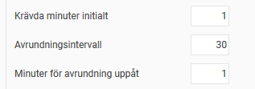
2: På bilden nedan är krävda minuter initialt inställt på 30, avrundningsintervall 30 och minuter för avrundning uppåt 1. Det innebär att du måste ha arbetat 30 minuter för att få övertid. All tid efter de första 30 minuterna avrundas uppåt till närmaste halvtimme.
Arbetar du 31 minuter övertid kommer det att avrundas uppåt till 1h.
Arbetar du 29 minuter övertid kommer det att avrundas bort.
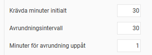
3: På bilden nedan är krävda minuter initialt inställt på 1, avrundningsintervall 30 och minuter för avrundning uppåt 30. Det innebär att man avrundar bort det som inte är en jämn halvtimme.
Arbetar du 35 minuter avrundas det till 30 minuter.
Arbetar du 20 minuter avrundas det bort.
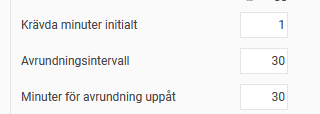
4: På bilden nedan är krävda minuter initialt inställt på 1, avrundningsintervall 30 och minuter för avrundning uppåt 15. Det innebär att man måste arbeta 15 minuter för att tiden ska avrundas uppåt till närmaste halvtimme.
Arbetar du 44 minuter avrundas det till 30 minuter.
Arbetar du 45 minuter avrundas det till 1h.
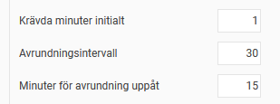
Tidkod att avrunda
An
vänds om flera tidkoder avrundas i samma regel.
Med mest tid
innebär att avrundningen läggs till/dras ifrån den tidkod som har mest tid innan avrundning.
Sist registrerad
innebär att avrundningen läggs till/dras ifrån den av tidkoderna som har den sista tidraden fö
r dagen i tidrapporten.
Exempel:
Jag har registrerat 15 minuter på tidkoden ÖB1 och 1h på tidkoden ÖB2. Övertid är inställt på att avrundas uppåt till närmaste halvtimme. Det innebär att jag ska få 15 minuter övertid till.
Är tidkod att avrunda inställt på
Med mest tid
kommer
dessa 15 minuter att läggas till tidkod ÖB2.
Är tidkod att avrunda inställt på
Sist registrerad
läggs de 15 minuterna på den tidkod som ligger sist i tidrapporten.
Tidkod vid avrundning nedåt
E
n tidkod som anges här samlar upp den tid som avrundas bort, t.ex. om man arbetat 35 minuter övertid, men endast 30 räknas som övertid och 5 som flexintjänande.
Tidkod vid avrundning uppåt
O
m man avrundar uppåt, t.ex. 15 minuter arbetad övertid blir 30 minuter, kan justeringen läggas till en tidkod.
Tidsintervall som regeln gäller
Ange min och max antal minuter där regeln ska gälla. Används sällan, men kan vara till nytta om man t ex avrundar de första tre timmarna på ett sätt, och tid över tre timmar på ett annat sätt.
Avrunda
Används för att ange om man ska samla ihop alla tidkoder i avrundningsregeln som använts under dagen innan avrundning, eller om man bara ska avrunda sammanhängande tider tillsammans.
Ställer man in
Sammanhängande tider
visas ytterligare en inställning:
Antal minuter framåt som ses som samma period.
Den är till för att hantera att om en andra övertidsperiod påbörjas inom t.ex. 3 timmar från det att den första börjar så ska inte en helt ny 3-timmarsperiod betalas ut.
Exempel:
Övertid är inställt på att avrundas uppåt till närmaste halvtimme.
Jag har arbetat 20 minuter övertid före arbetstid och 40 minuter efter arbetstid.
Alternativ 1:
Avrunda är inställt på
Sammanhängande tider.
Morgontiden avrundas till 30 minuter och eftermiddagstiden till 1h, så jag får sammanlagt 1h 30 minuter övertid.
Alternativ 2:
Avrunda är inställt på
Hela dagen
.
Övertiden räknas ihop till 1h, vilket gör att avrundning inte sker.
Exempel tidkodsavrundningsinställning och utfall i tidrapport
Exempel 1
En regel kan se ut som nedan. Övertid som registreras på tidkoderna ÖBE och ÖBK ska tillsammans bli jämna halvtimmar. Registrerar man 32 minuter blir 30 av dessa övertid och 2 minuter läggs till tidkoden ARB, för att de ska räknas som flexintjänande.
Regeln säger att du måste arbeta 30 minuter för att få 30 minuter, vilket gör att avrundning uppåt aldrig sker.
Om du registrerar 28 minuter ÖBE och 4 minuter ÖBK kommer 2 minuter ÖBE att avrundas bort och läggas som ARB eftersom Tidkod att avrunda är inställt på Med mest tid.
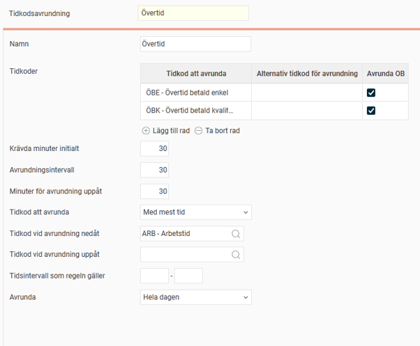
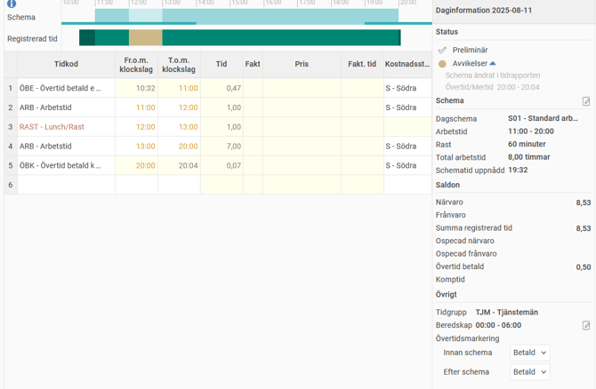
Exempel 2
Regeln nedan säger att ÖBE och ÖBK ska avrundas till jämna halvtimmar. Har du arbetat 15 minuter avrundas det uppåt, medan minut 1-14 i en påbörjad halvtimme avrundas bort.
I tidrapporten registreras 10 minuter ÖBE före arbetstid och 40 minuter ÖBK efter arbetstid.
Eftersom regelverket avrundar
Sammanhängande tider
försvinner ÖBE. ÖBK avrundas ner till 30 minuter.
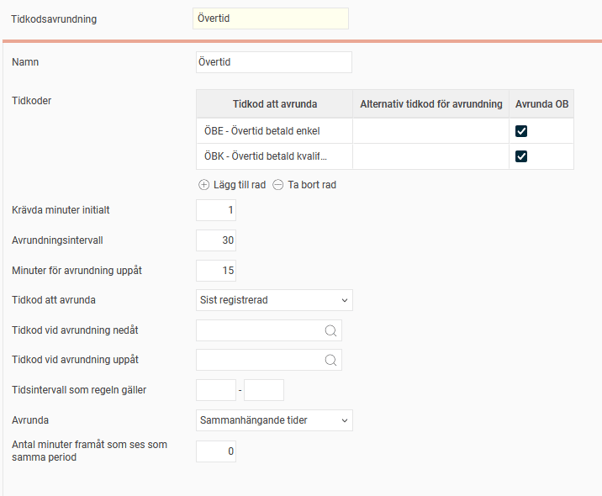
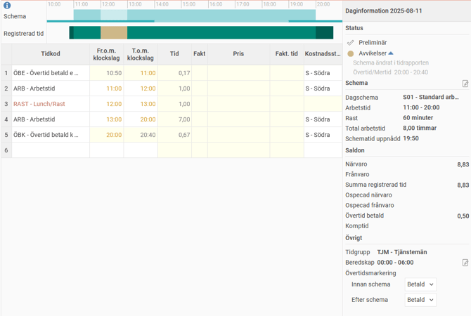
Om regelverket hade varit inställt på att avrunda
Hela dagen
hade övertiden blivit 1 timme eftersom 40 + 10 = 50.
Tidkod att avrunda är
Sist registrerad,
vilket i detta fall är ÖBK. Det gör att tio minuter läggs till ÖBK.
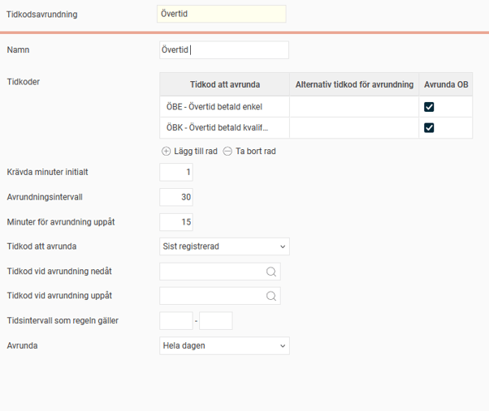
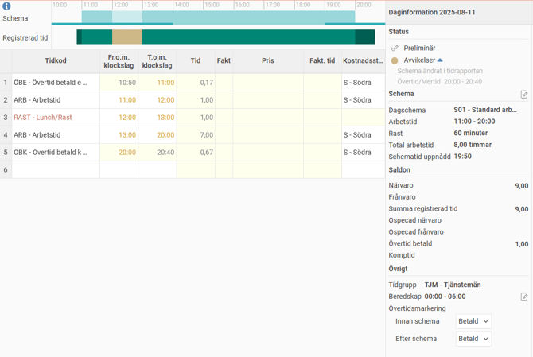
