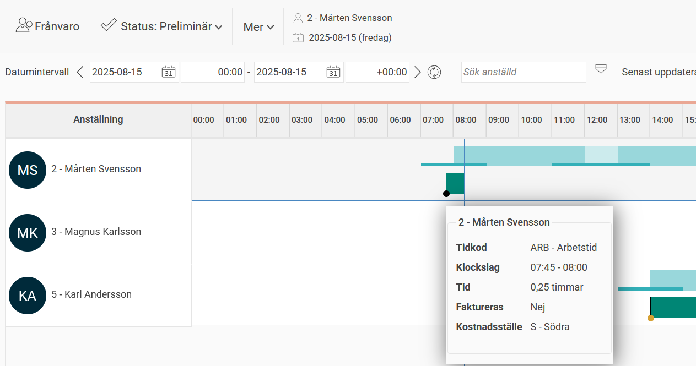
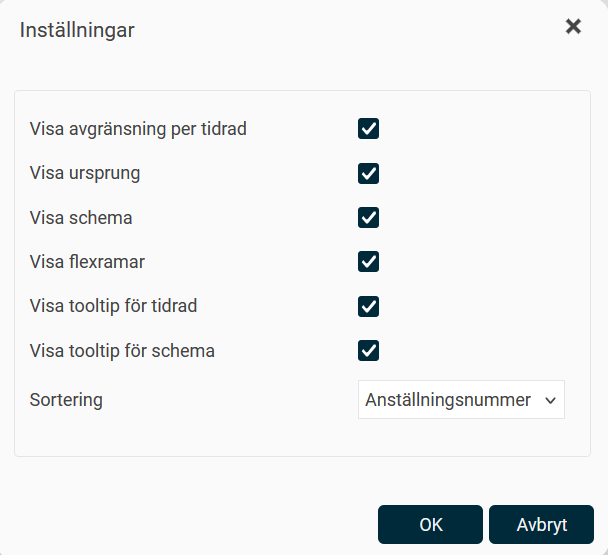
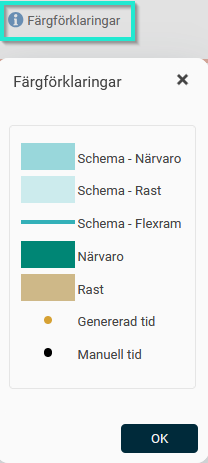

# Tidrapport - Hur fungerar vyn Översikt?

**Datum:** den 29 september 2025  
**Kategori:** Time  
**Underkategori:** Mobil & Stämpling  
**Typ:** feature  
**Svårighetsgrad:** intermediate  
**Tags:** frånvaro, stämpling, tidrapport  
**Bilder:** 3  
**URL:** https://knowledge.flexhrm.com/sv/tidrapport-hur-fungerar-vyn-%C3%B6versikt

---

Översikt
visar grafiskt tider från din tidrapport (och de anställdas vars tidrapporter du är behörig till).
Aktuell tidpunkt visas med ett blått lodrätt streck. Samtliga tidrader som rapporterats visas här som en grafisk, horisontell, tidslinje. Det som visas är frånvaro, konteringsbyte, instämpling etc.
Håll muspekaren över en sektion för att se alla detaljer från tidrapporten.

Använd
Mer > Inställningar
för att anpassa visningen enligt dina önskemål.

Klicka på
Färgförklaringar
för att få en förklaring av alla de saker som visas för dig just nu (denna förklaring kan alltså se olika ut beroende på vilken information den behöver förklara).

