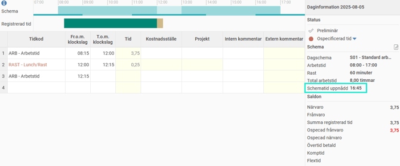

# Vad är "Schematid uppnådd"?

**Datum:** den 26 september 2025  
**Kategori:** Time  
**Underkategori:** Mobil & Stämpling  
**Typ:** concept  
**Svårighetsgrad:** beginner  
**Tags:** schema, tidrapport  
**Bilder:** 1  
**URL:** https://knowledge.flexhrm.com/sv/vad-%C3%A4r-schematid-uppn%C3%A5dd

---

Vad betyder det när det i min tidrapport står till exempel “Schematid uppnådd: 17:15”?
Schematid uppnådd
visas i din tidrapport om du dagredovisar och har flextidsramar i ditt schema. Tiden som visas är det klockslag då du har arbetat din schemalagda tid för dagen.

Exempel:
Om ditt schema är 08:00-17:00 och du har en timmes rast, behöver du arbeta åtta timmar.
Stämplar du in klockan 08:15 visar
Schematid uppnådd
klockan 17:15.
Tar du en kortare rast, till exempel 30 minuter, visas
Schematid uppnådd
istället som 16:45.
