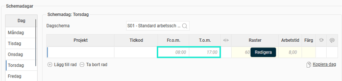
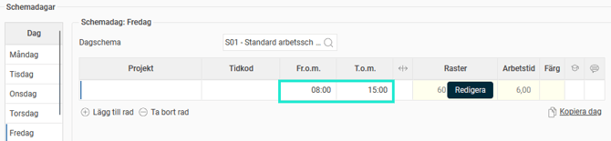
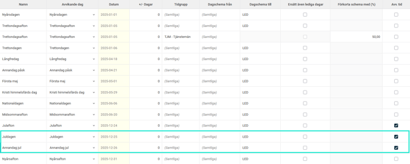
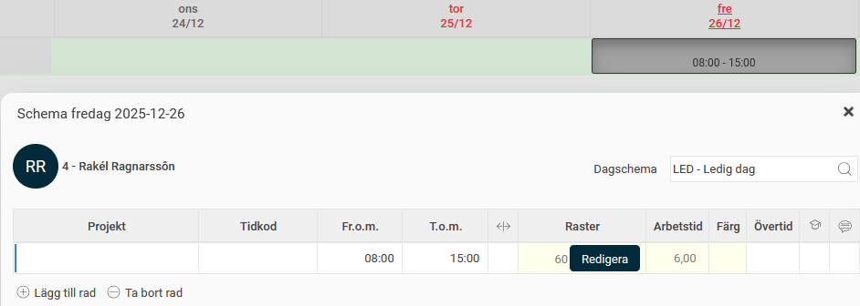

# ⚙️Vad betyder "Avv. tid" i vyn Avvikelsedagar?

**Datum:** den 11 december 2025  
**Kategori:** Time  
**Underkategori:** Inställningar  
**Typ:** concept  
**Svårighetsgrad:** beginner  
**Tags:** schema  
**Bilder:** 6  
**URL:** https://knowledge.flexhrm.com/sv/vad-betyder-avv.-tid-i-vyn-avvikelsedagar

---

Den här artikeln förklarar med exempel inställningen Avv. tid i vyn Avvikelsedagar.
Avvikelsedagar använder du för att ställa in hur scheman automatiskt ska hantera avvikande dagar under året, till exempel om de ska ändras till ledig dag på röda dagar som infaller på vardagar. För en fullständig genomgång av inställningarna rekommenderar vi att du läser artikeln
Avvikelsedagar - Hur ställer man in schema för avvikande dagar?
Vad innebär
Avv. tid
?
Att bocka i
Avv. tid
i vyn
Avvikelsedagar
innebär att tider som du har angett
manuellt
i ett schema ska fortsätta att gälla, även om schemat i övrigt skrivs över av avvikelsedagen.
Manuellt angivna tider visas som
svarta
.

Tider som ärvts från ett grundläggande dagschema visas som gråa.

Exempel
Låt oss ta ett exempel för att förklara hur
Avv. tid
fungerar:
Anställd 4
har ett personligt schema där hen på arbetsdagar har dagschemat
S01
.
Dagschema S01
har grundarbetstiden 08:00–17:00, och detta gäller för anställd 4 måndag till torsdag.

På
fredagar
arbetar hen 08:00–15:00. Istället för att skapa ett separat dagschema valde man att använda
S01
i det personliga schemat, men
manuellt ändra
arbetstiden på fredagar till 08:00–15:00.

I vyn Avvikelsedagar har vi ställt in följande:
På
Juldagen
och
Annandag jul
ska dagschemat bytas till
LED
(Ledig dag).
Inställningen
Avv. tid
är
ibockad.

Resultat:

Juldagen
infaller på en torsdag. På torsdagar ärvde anställd 4 tiderna från dagschemat (
gråa tider
).
Dagschemat ändras till
LED
och anställd 4 blir
helt ledig
.
Annandag jul
infaller på en fredag. På fredagar har anställd 4
manuella tider
(
svarta tider
): 08:00–15:00.
Eftersom
Avv. tid
är ibockat får hen dagschemat
LED
med den manuellt angivna arbetstiden
08:00–15:00
.
Vad händer om Avv. tid inte är ibockat?
Hade
Avv. tid
inte varit ibockat, hade hen bytt till
LED
utan arbetstid (helt ledig) båda dagarna.
I exemplet har vi ett personligt schema. Samma princip gäller om du använder ett publikt schema med manuellt angivna tider.
