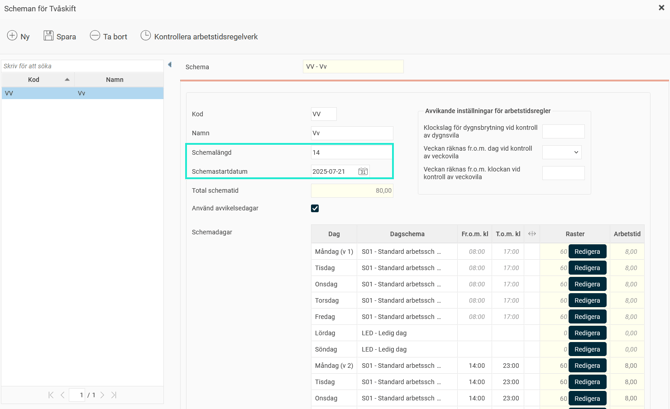
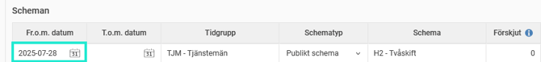
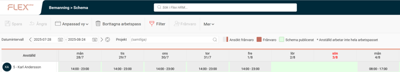
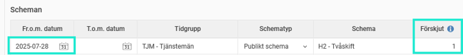
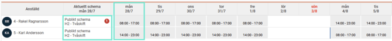

# ⚙️Vad betyder schemastartdatum?

**Datum:** den 26 september 2025  
**Kategori:** Time  
**Underkategori:** Schema & Planering  
**Typ:** concept  
**Svårighetsgrad:** beginner  
**Tags:** ob, schema  
**Bilder:** 5  
**URL:** https://knowledge.flexhrm.com/sv/vad-betyder-schemastartdatum

---

Artikeln förklarar med exempel begreppet "Schemastartdatum" som används i flerveckorsscheman.
I
publika och personliga scheman
skapar man
delscheman/schemacykler
där man definierar hur schemat ska se ut. Har man en sjudagarscykel anger man scheman för måndag till söndag. Har man mer än sju dagar i cykeln, t.ex. ett schema som ska löpa på två veckor, anger man scheman för måndag till söndag vecka 1 och måndag till söndag vecka 2.
Man måste då också
ange ett
s
chemastartdatum
, för att HRM ska veta vilken dag som faller in när.

Exempel 1
Det publika schemat H2 (bilden ovan) har ett schema med en schemalängd på 14 dagar.
M
åndag - fredag vecka 1 ska man arbeta kl 08:00-17:00, vecka 2 är schemat kl 14:00-23:00.
Att schemastartdatum är satt till 2025-07-21 innebär att schemats vecka 1 infaller samma vecka som 2025-07-21, och rullar på utifrån det.
Anställd 5 tilldelas det publika schemat fr.o.m. 2025-07-28. Det innebär att han hoppar in på vecka 2 i schemacykeln.

Schemastartdatum säger alltså inte när schemat börjar gälla för anställda, utan används endast för att definiera veckorna i cykeln, oavsett när schemat används.
Exempel 2, förskjutning av schema
Anställd 4 och 5 ska turas om att jobba dag respektive kväll. Anställd 5 går på schemat i exempel 1. Vi behöver inte skapa ett nytt publikt schema för anställd 4, utan kan använda samma som anställd 5. På schemaraden i anställdaregistret anger vi att schemat ska förskjutas med en vecka. Det innebär att schemastartdatumet är en vecka senare för anställd 4 än i grund-publika schemat. Anställd 4 har alltså samma schema, men schemastartdatum 2025-07-28, vilket gör att han hoppar in på vecka 1 i schemacykeln 2025-07-28.

Relaterade artiklar
Hur skapar man ett publikt schema?
Hur skapar man ett personligt schema?
