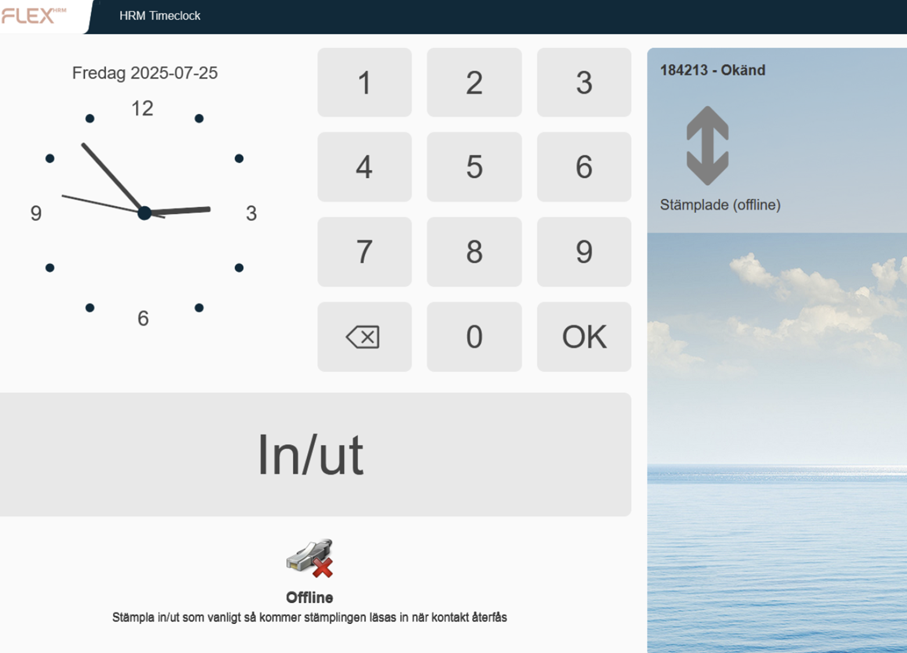
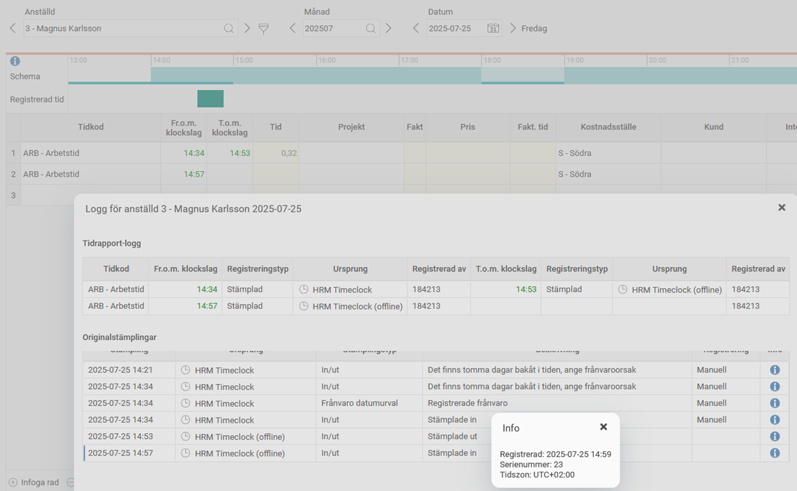

# Vad händer när stämpelklockan är offline?

**Datum:** den 21 augusti 2025  
**Kategori:** Time  
**Underkategori:** Mobil & Stämpling  
**Typ:** other  
**Svårighetsgrad:** intermediate  
**Tags:** frånvaro, stämpling, tidrapport  
**Bilder:** 2  
**URL:** https://knowledge.flexhrm.com/sv/vad-h%C3%A4nder-n%C3%A4r-st%C3%A4mpelklockan-%C3%A4r-offline

---

När stämpelklockan saknar kontakt med HRM kan man ändå stämpla In/Ut. Stämplingen kommer att läsas in i tidrapporten när kontakten återupprättas.
HRM Timeclock kan endast ta emot In/Ut-stämplingar vid dessa tillfällen, inte ställa frågor om frånvaroorsak vid sen instämpling och liknande.

I tidrapportens logg syns det att en offlinestämpling gjorts. Det syns vilket klockslag stämplingen gjordes och när den blev inläst. På bilden nedan finns en offlinestämpling som nått HRM kl 14:59, men i tidrapporten läses in som 14:57 eftersom det var då den gjordes.

