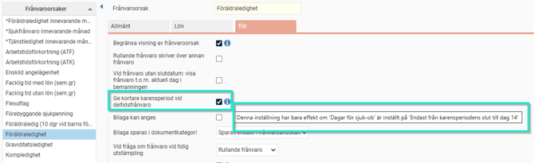

# ⚙️Vad innebär inställningen "Ge kortare karensperiod vid deltidsfrånvaro"

**Datum:** den 26 september 2025  
**Kategori:** Time  
**Underkategori:** Frånvaro & Semester  
**Typ:** config  
**Svårighetsgrad:** intermediate  
**Tags:** frånvaro, ob  
**Bilder:** 1  
**URL:** https://knowledge.flexhrm.com/sv/vad-inneb%C3%A4r-inst%C3%A4llningen-ge-kortare-karensperiod-vid-deltidsfr%C3%A5nvaro-

---

Under Frånvaroorsaker finns en inställning som gäller för vissa Kollektivavtal som tolkar att obetald deltidsfrånvaro såsom föräldraledighet och tjänstledighet ska ge kortare karensperiod på samma sätt som lägre sysselsättningsgrad.
OBS! Används alltså enbart om Kollektivavtalet innehåller denna regel.

Tips:
Vill du läsa om övriga inställningar i systemet som berör
deltidsfrånvaro
så klicka här.
