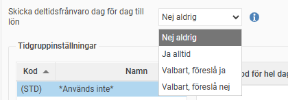
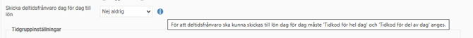
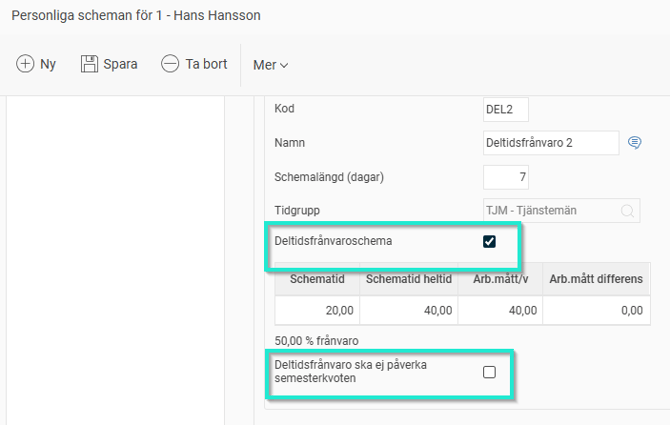

# ⚙️Vad innebär inställningen "Skicka deltidsfrånvaro dag för dag till lön" under inställningar för Frånvaroorsaker?

**Datum:** den 26 september 2025  
**Kategori:** Time  
**Underkategori:** Frånvaro & Semester  
**Typ:** config  
**Svårighetsgrad:** intermediate  
**Tags:** frånvaro, lön, ob, schema, semester, tidrapport  
**Bilder:** 3  
**URL:** https://knowledge.flexhrm.com/sv/vad-inneb%C3%A4r-inst%C3%A4llningen-skicka-deltidsfr%C3%A5nvaro-dag-f%C3%B6r-dag-till-l%C3%B6n-under-inst%C3%A4llningar-f%C3%B6r-fr%C3%A5nvaroorsaker

---

Deltidsfrånvaro dag för dag (Kollektiavtal IF-metall)
OBS! denna funktion används enbart av företag inom kollektivavtalet IF-Metall som valt att tolka att deltidsfrånvaro skall behandlas på ett specifikt sätt och man önskar kunna skicka deltidsfrånvaron dag för dag.
Till de flesta lönesystem skickas deltidsfrånvaro med datumintervall och omfattning oavsett om deltidsfrånvaron är minskad lika mycket varje dag eller intermittent. Man kan välja att deltidsfrånvaron ska föras över till lön per dag istället, som om den hade legat manuellt inlagd i tidrapporten.
Om deltidsfrånvaron skickas dag för dag som om den hade legat i tidrapporten kommer frånvarons tid att räknas som differensen mellan antal timmar heltid och deltidsfrånvaroschemats schematid.
Under
Inställningar > Tid och Bemanning > Frånvaroorsaker > Flik Tid
finns valen:

Nej aldrig
. Innebär att det beter sig som tidigare och är standardvalet om du inte gör någon ändring.
Ja alltid.
Innebär att deltidsfrånvaron skickas dag för dag som om den hade legat i tidrapporten.
Valbart, föreslå ja
. Innebär att användaren får välja och det föreslagna valet är ja.
Valbart, föreslå nej
. Innebär att användaren får välja och det föreslagna valet är nej.
Om något av de två nedersta alternativen är valt kommer denna inställning att visas i frånvarofunktionen i HRM när den frånvaroorsaken valts.
I samma kollektivavtal vill man även kunna välja hur man vill skicka semesterkvoten i samband med en deltidsfrånvaro. Under
Inställningar > Tid och Bemanning > Tidrapporter
har man möjligheten att välja om deltidsfrånvaron ska påverka semesterkvoten eller ej.
Alltid är standardvalet och så som det tidigare fungerat d.v.s att deltidsfrånvaroschemat påverkar uträkningen av semesterfaktorn.
Väljer du Aldrig så kommer semesterkvoten beräknas utifrån antal timmar heltid istället för schematiden på deltidsfrånvaroschemat.
Väljer du Valbart så kan man i personregistret under Personliga scheman ta fram deltidsfrånvaroschemat och välja om den ska påverka semesterkvoten eller ej. Man kan alltså inte välja kryssrutan när man i första skedet registrerar deltidsfrånvaron i tidrapporten utan måste göra detta i efterhand. Default är den ej ikryssad och fungerar sålunda som alternativet Alltid.

Tips:
Vill du läsa om övriga inställningar i systemet som berör
deltidsfrånvaro
så klicka här.
