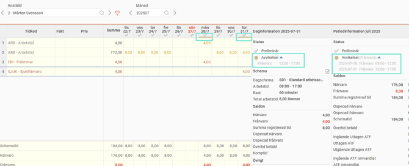
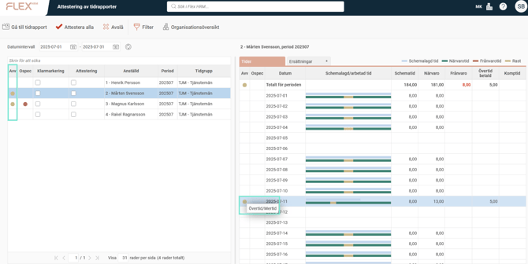
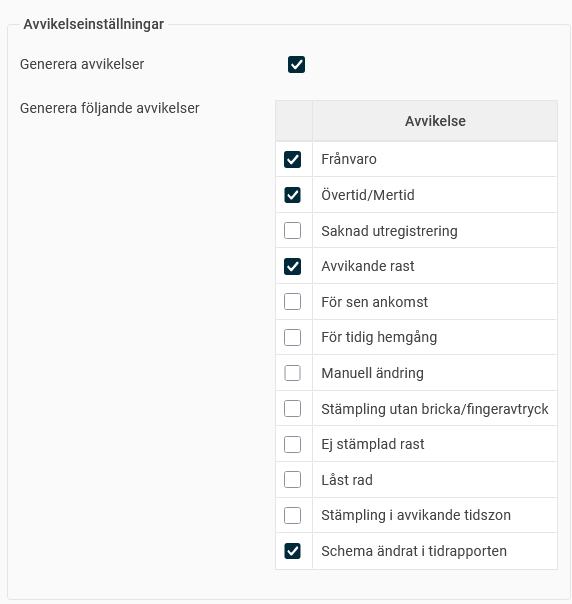
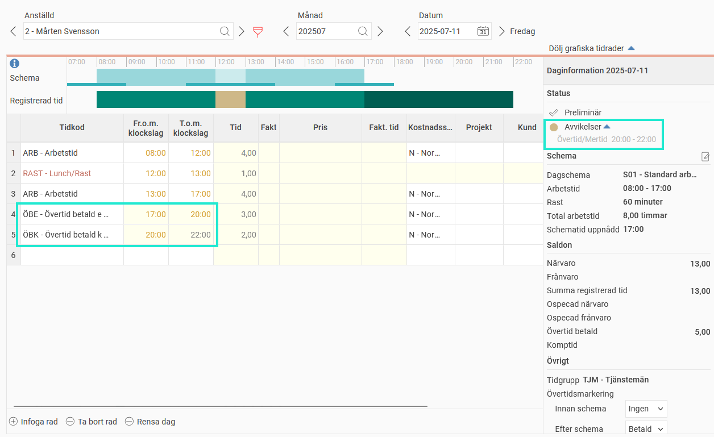
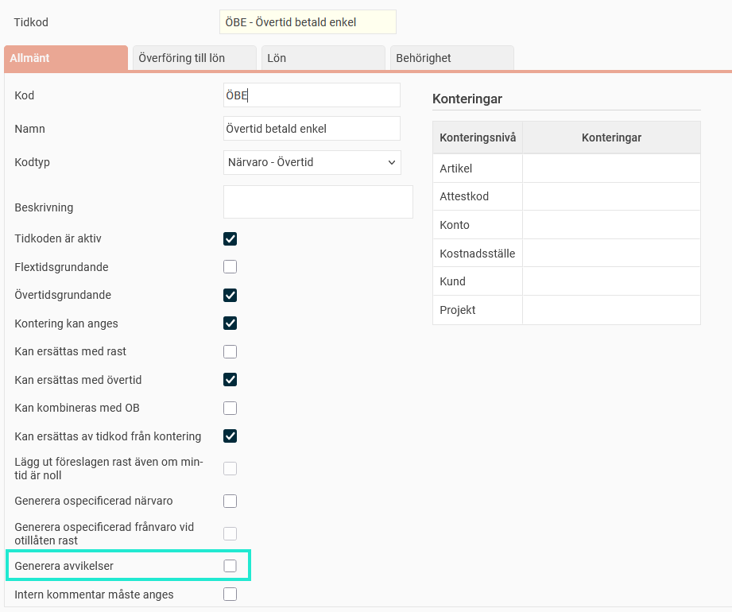
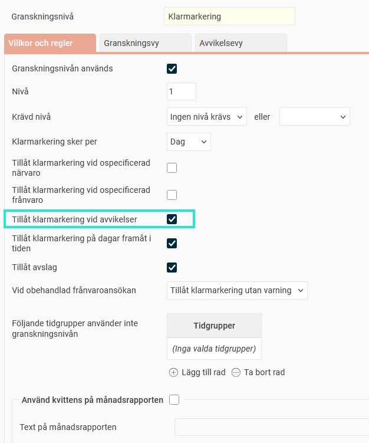

# Vad markeras som avvikelse i tidrapporten?

**Datum:** den 27 augusti 2025  
**Kategori:** Time  
**Underkategori:** Tidrapportering  
**Typ:** other  
**Svårighetsgrad:** intermediate  
**Tags:** frånvaro, schema, stämpling, tidkod, tidrapport, övertid  
**Bilder:** 6  
**URL:** https://knowledge.flexhrm.com/sv/vad-markeras-som-avvikelse-i-tidrapporten

---

Avvikelser visas med en gul markering i tidrapporten. Artikeln berättar om hur avvikelser hanteras i HRM Time.
Hur visas avvikelser?
Vad räknas som en avvikelse?
Undanta tidkoder från avvikelser
Kan man granska tidrapporter som har avvikelser?
Hur visas avvikelser?
Avvikelser i tidrapporten är sådant du kan vilja titta närmare på, men de innebär inte att något i rapporteringen är felaktigt. Avvikelser markeras med gul färg i tidrapporten, och du kan få mer information i kolumnerna Daginformation, Periodinformation samt i granskningsvyerna.

Vad räknas som en avvikelse?
Vad som ska ge avvikelser ställs in per företag (Tidrapporter), per tidgrupp eller per anställd. Du kan inaktivera avvikelser helt (bocka ur “Generera avvikelser"). De händelser som kan ge avvikelser är Frånvaro, Övertid/Mertid, Saknad utregistrering, Avvikande rast, För sen ankomst, För tidig hemgång, Manuell ändring, Stämpling utan fingeravtryck/bricka, Ej stämplad rast, Låst rad, Stämpling i avvikande tidszon, Schema ändrat i tidrapporten.

Undanta tidkoder från avvikelse
I tidkodsregistret finns inställningen “Generera avvikelser”. Är den urbockad kommer avvikelse inte att genereras även om tidraden borde ha genererat en avvikelse. Det kan t.ex. handla om att övertid ska generera avvikelse, men inte om övertiden är utlagd på en specifik tidkod. I exemplet nedan visas avvikelse endast för övertiden kl 20:00-22:00, eftersom tidkoden ÖBE, 17:00-20:00, är inställd på att inte generera avvikelser.

Kan man granska tidrapporter som har avvikelser?
Under
Inställningar > Allmänt > Granskningsnivåer > Tidrapporter
anger man per granskningsnivå om avvikelser innebär en spärr för granskning. Ofta tillåts granskning vid avvikelser (då de inte behöver rättas till utan bara ska kontrolleras) men inte vid ospecad tid (då den ska ändras till t.ex. övertid eller frånvaro).

