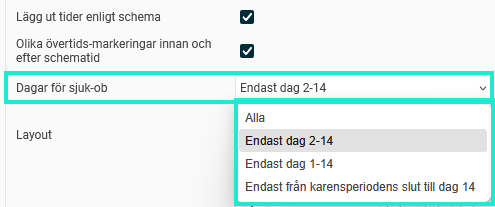

# Varför faller sjuk-OB ut efter dag 14?

**Datum:** den 2 september 2025  
**Kategori:** Time  
**Underkategori:** Frånvaro & Semester  
**Typ:** other  
**Svårighetsgrad:** advanced  
**Tags:** frånvaro, lön, ob, tidrapport  
**Bilder:** 1  
**URL:** https://knowledge.flexhrm.com/sv/varf%C3%B6r-faller-sjuk-ob-ut-efter-dag-14

---

Denna artikel förklarar varför det i tidrapporten kan se ut som att man fått för mycket sjuk-OB.
En inställning som kan göras per anställd, tidgrupp eller för hela företaget styr vilka dagar i en sjukfrånvaroperiod som ska ha sjuk-OB.

Bilden ovan visar de alternativ man kan välja för inställningen "Dagar för sjuk-OB":
Alla
: Sjuk-OB gäller för alla dagar i en sjukperiod, oavsett hur lång den är.
Endast dag 2-14
:
S
juk-OB tas bort från första dagen och från dag 15 och framåt.
E
ndast dag 1-14
: Sjuk-OB tas bort från dag 15 och framåt.
Endast från karensperiodens slut till dag 14
: S
juk-OB tas bort från de första 20% av veckoarbetstid och från dag 15 och framåt. Karensperiod är alltså det faktiska arbetsmåttet per vecka delat på 5.
I HRM Time faller sjuk-OB initialt ut enligt OB-regelverket för all sjukfrånvaro, oavsett inställning och antal dagar. Varje natt körs ett jobb som plockar bort sjuk-OB från de granskade dagar som inte ska ha sjuk-OB.
Det görs också en koll vid löneöverföring. Om ma
n granskat tidrapporten samma dag som lönekörningen görs har det nattliga jobbet inte hunnit köras. Då plockas sjuk-OB bort vid överföringen till lön.
Relaterade artiklar:
Läs mer om tidrapportens inställningsnivåer
Hur hanterar man karensavdrag i HRM Time?
Hur fungerar OB-regelverk?
Hur ställer jag in regler för sjuk-OB?
